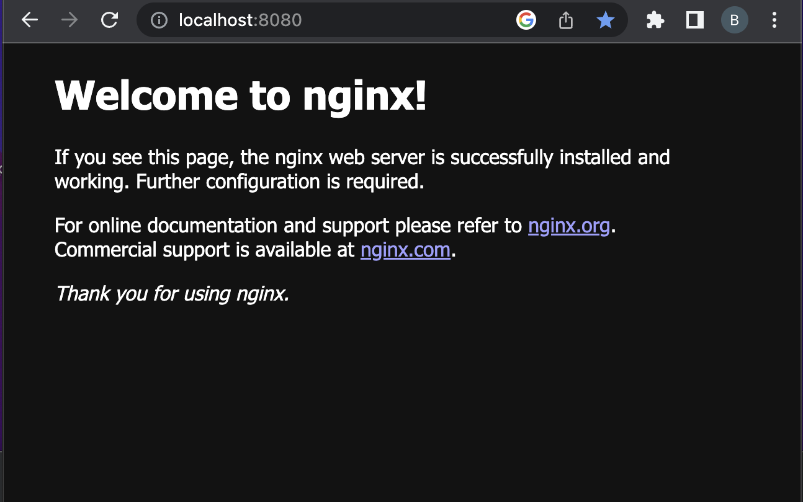

= Web Server

____

웹 서버는 웹 브라우저와 같은 클라이언트로부터 HTTP 요청을 받아들이고, HTML문서와 같은 웹 페이지를 반환하는 컴퓨터 프로그램

____

== 정의

* *웹 서버* (Web server)는 HTTP 또는 HTTPS를 통해 웹 브라우저에서 요청하는 HTML 문서나 오브젝트(이미지 파일 등)를 전송해 주는 서비스 프로그램을 말한다.
** http 프로토콜을 통해
** *웹 브라우저에서 요청 -&gt; 전송해 주는 서비스 프로그램*
*** HTML 문서
*** 이미지 파일(jpg, png, gif, …)
*** JavaScript Object

== 종류

* apache
** https://httpd.apache.org/[https://httpd.apache.org]
* nginx
** https://www.nginx.com/[https://www.nginx.com]

== Homebrew 설치 ( for mac )

* 패키지 관리
** https://brew.sh/index_ko
[source,shell]
----
/bin/bash -c "$(curl -fsSL https://raw.githubusercontent.com/Homebrew/install/HEAD/install.sh)"

----

== Nginx 설치 (for mac)

* install

----
brew install nginx
----

* nginx start,stop

----
brew services start|stop nginx
----

* remove
----
brew remove nginx

rm -rf /usr/local/etc/nginx
----

== Nginx 설치 (for ubuntu)

* install

[console,sh]
----
sudo apt-get update
sudo apt-get install nginx
----

* nginx start,stop
[console,sh]
----
sudo service nginx start | stop
----

* remove
[console,sh]
----
sudo apt-get remove --purge nginx nginx-full nginx-common
----

== 설치확인
** http://localhost:8080/

== 실습 - Nginx에 html 파일 추가

* document root 위치에 hello.html 파일 생성
** /usr/local/var/www

[source,html]
----
<!DOCTYPE html>
<html>
        <body>
                <h1>hello nginx!</h1>
        </body>
</html>
----

* 웹 브라우저에서 확인
** http://localhost:8080/hello.html

== Dynamic Web Contents ( 동적 웹 콘텐츠)

* 방문 시간, 위치, 장치 등 사용자에 특정한 요인이나 요청에 따라 변경되는 콘텐츠
* 동적 웹 콘텐츠는 모든 사용자에게 동일하게 표시되지 않을 수 있으며 사용자와의 상호작용에 따라 변경될 수 있다

== Static Web Contents

* 웹서버에 미리 저장되어 있는 콘텐츠
* 모든 사용자에게 동일한 내용이 전달
* HTML 파일, 이미지 등
