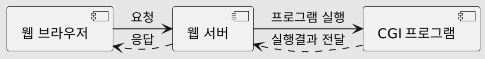
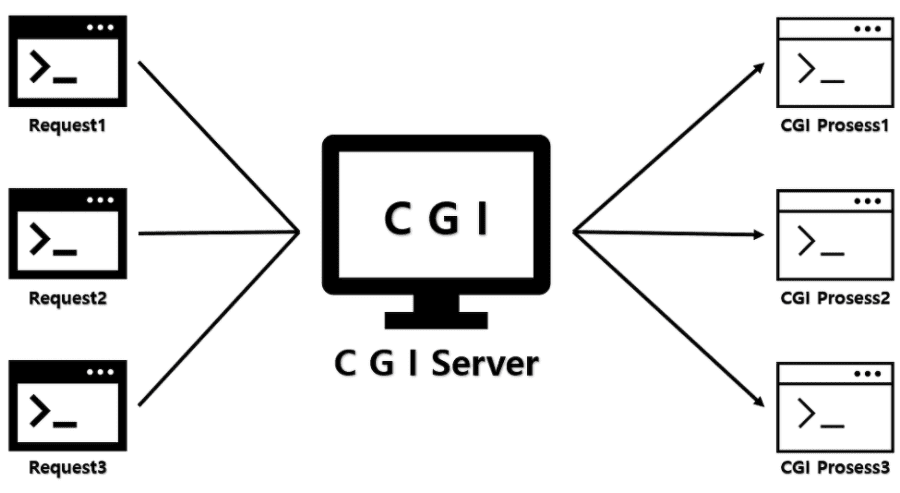
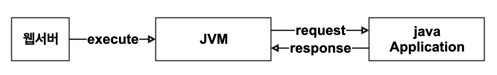
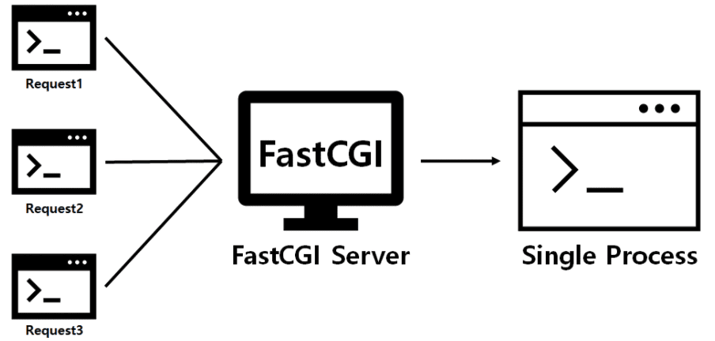

= CGI

* Common Gateway Interface
* 웹 서버가 **외부 프로그램**을 실행할 수 있도록 해주는 인터페이스 명세(specification)
** 외부 프로그램 = 동적 웹 콘텐츠 생성하는 역할
** c, c++, java, php , go …
* 웹 서버와 CGI 프로그램(Application) 간의 규칙

* 환경변수나 표준입출력을 다룰 수 있는 프로그램 언어라면 어떤 언어든지 확장하여 이용 가능
* 실행속도나 텍스트 처리의 용이함 등의 이유로 perl이나 python, ruby 등의 스크립트 언어를 주로 사용

=== CGI 프로그램

* 컴파일 방식

** 기계어. 컴파일된 상태
** c++, c
* 인터프리터 방식

** 스크립트 언어
** Asp, Php, Python, Per
** 스크립트 엔진
*** 해당 스크립트를 실행할 수 있는 엔진
** 즉시 코드를 수정할 수 있음

## CGI Spec

=== CGI Version 1.1

* https://datatracker.ietf.org/doc/html/rfc3875

=== 입출력

* 주로 표준 입출력 사용

=== Meta-Variables ( 메타 변수 )

* 웹서버에서 CGI 프로그램으로 전달되는 요청 관련 데이터
* 주로 환경변수 (environment variable) 형태로 구현
** SERVER_NAME
** SERVER_PORT
** REMOTE_ADDR
** REQUEST_METHOD
** CONTENT_TYPE
** CONTENT_LENGTH

=== Script ( 스크립트)

* 서버에 의해 호출되는 소프트웨어
* 런타임에 해석되는 일련의 명령문

=== 장점

* 언어, 플랫폼에 독립적
* 구조가 단순하고 다른 서버 사이드 프로그래밍 언어에 비해 쉽게 수행

=== 단점

* 속도가 느림
** 매 요청마다 DB Connection을 새로 열어야 합니다.
* Http 요청마다 새로운 프로세스를 만들어 서버 메모리를 사용합니다.
* 데이터가 메모리에 캐시 될 수 없다.

== Java CGI 프로그램

=== Java Application은 컴파일 방식 ?

* .class 형태로 컴파일된 Java는 컴파일 방식으로 실행 가능 할까요?
** **실행 불가능합니다.** JVM은 Java를 실행할 수는 있지만 웹서버와 java application Server간의 통신할 수 없습니다.

* 웹서버와 Java Application 사이에서 서로 통신할 수 있도록 한 JCGI가 있어야 합니다.

=== JCGI

* Java로 작성한 프로그램을 구동하기 위한 CGI 프로그램

=== Java로 작성한 CGI 프로그램

[source,java]
----
public class CgiMain {
    public static void main(String[] args) {
        System.out.println("Content-type: text/plain");
        System.out.println();

        System.getProperties().forEach((k, v) -> {
            System.out.println(k + "=" + v);
        });
    }
}

----

### cgi-bin 디렉터리에 Java CGI를 실행할 수 있는 shell 추가

* JCGI( 실행 가능해야 함 )
[source,shell]
----
#!/bin/bash
#printf "Content-type: text/plain\n\n"
#printf "REQUEST_METHOD=$REQUEST_METHOD\n"

java -jar /some/path/javacgi.jar
----

=== Java CGI 문제점

* *별도의 스크립트가 필요*

** jcgi
** Java 런타임 인터프리터 실행
** main class 지정
* *환경변수를 명시적으로 Java 프로그램에 넘겨줘야 함*

** java -jar /some/path/javacgi.jar
** java -jar -Dcgi.request_method=$REQUEST_METHOD /some/path/javacgi.jar

== Fest CGI

____
FastCGI의 주목적은 웹 서버와 CGI 프로그램 통신 시 발생하는 부하를 줄임으로써 서버가 한 번에 더 많은 웹 페이지 요청을 관리할 수 있게 하는 것이다.
____

* 하나의 큰 프로세스로 동작합니다.
* 대부분의 웹서버가 Fast CGI를 제공합니다.
** Apache
** Nginx
** IIS

=== Java는 Web Application Server인 `Tomcat` 을 사용합니다.

* Web Application Server == WAS 라고 표현합니다.

== Reference
* https://www.infoworld.com/article/2076863/write-cgi-programs-in-java.html[Write CGI programs in Java]
