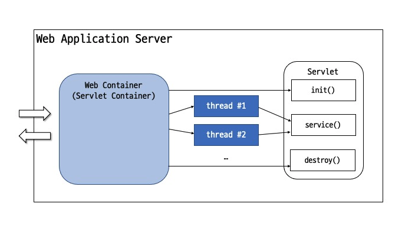
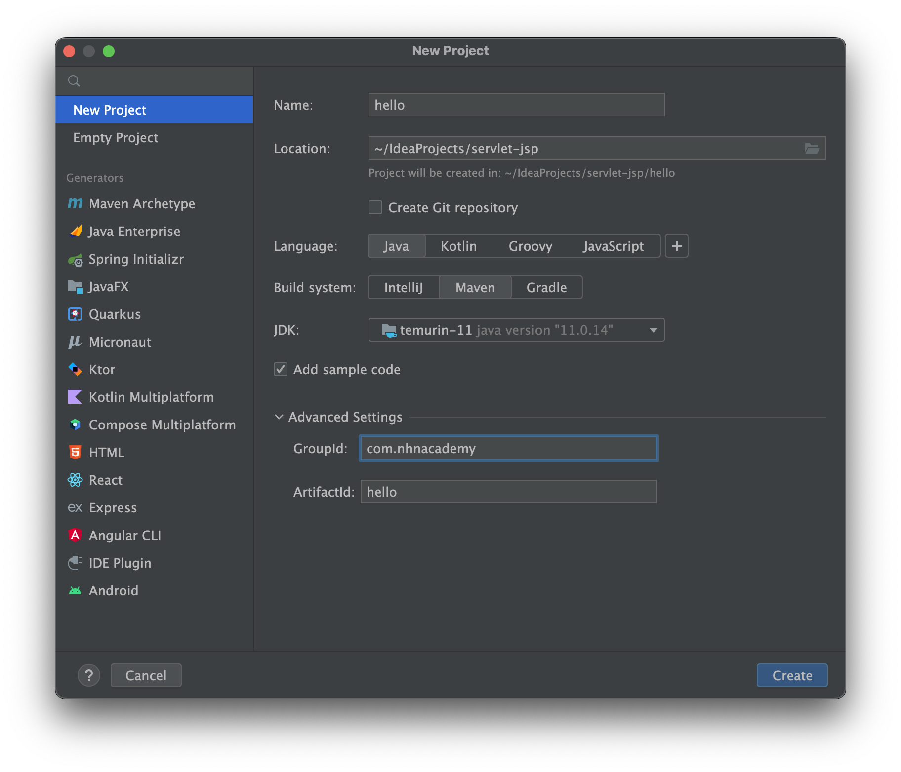
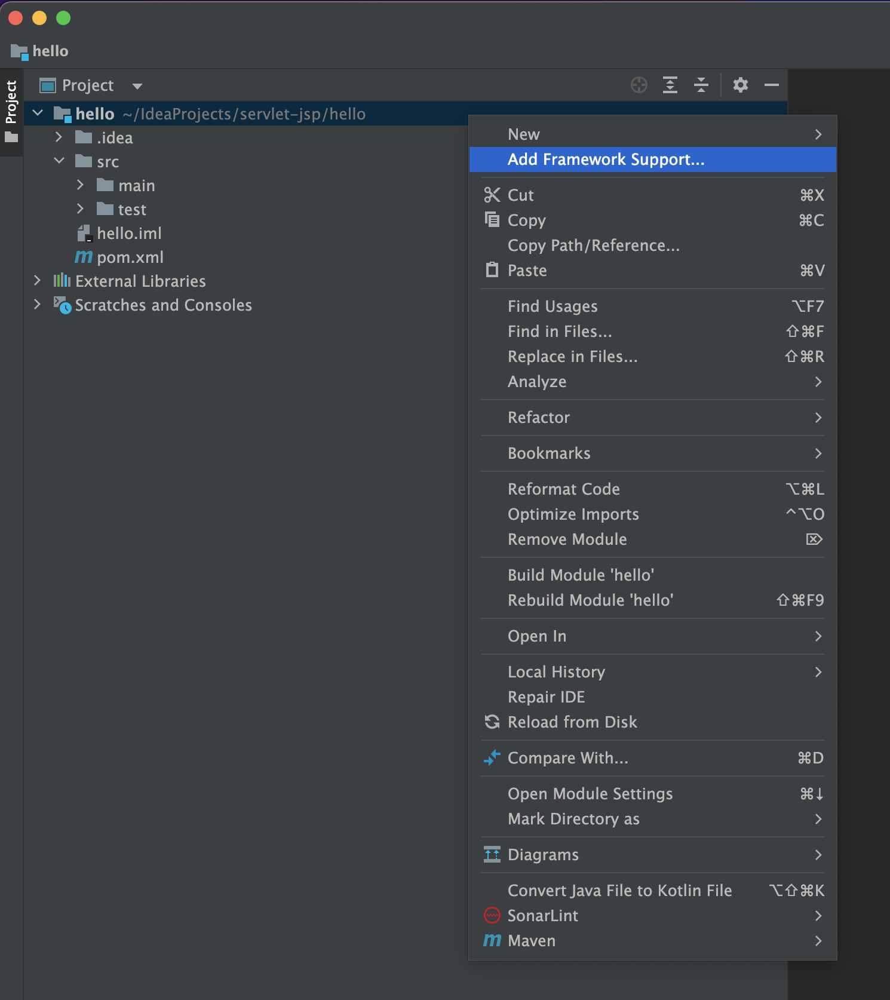
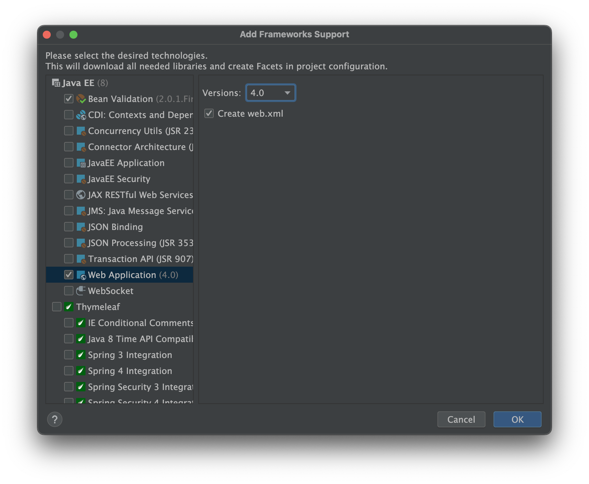
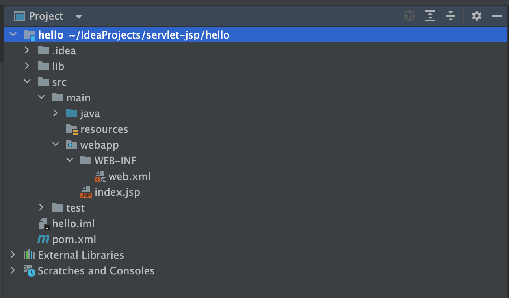
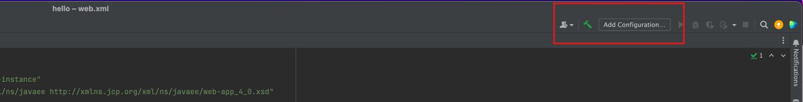
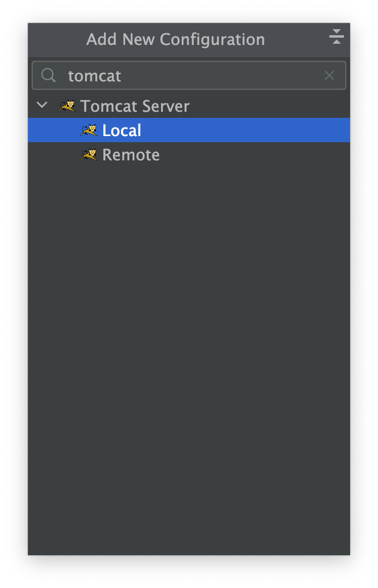
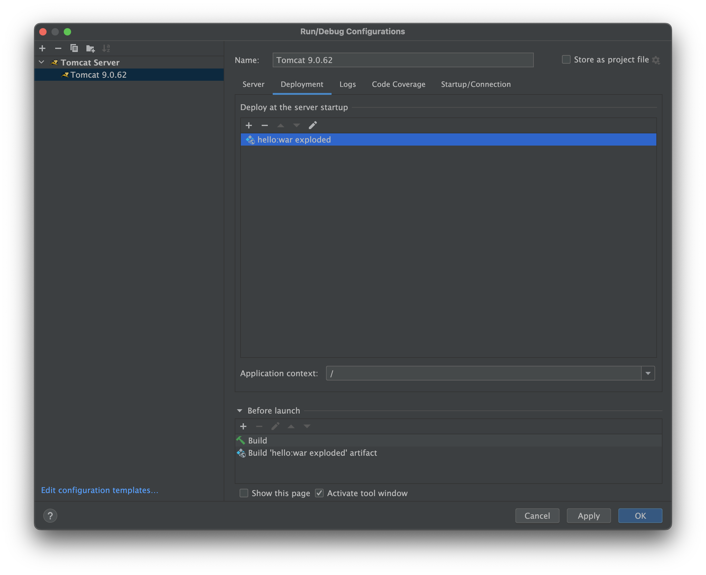
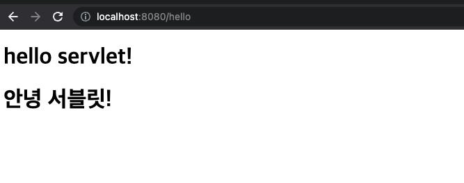

= Servlet 이란?

== 정의

* Java를 사용하여 동적 웹 콘텐츠를 생성하는 서버 측 프로그램
* 쉽게 말해, Java로 만든 CGI 프로그램 같은 것
* Servlet 인터페이스를 정의
** 즉 Servlet 인터페이스를 구현 -> java로 구현한 CGI 프로그램이라 할 수 있습니다.

== CGI의 단점을 해결한?

* 요청마다 새로운 프로세스가 생성 (CGI) -> 멀티 스레드로 해결
* 스레드는 누가 생성하고 관리하나 -> 컨테이너의 등장

== Servlet Architecture

=== Servlet Container ( wiki )

* 웹 컨테이너(web container, 또는 서블릿 컨테이너)는 웹 서버의 컴포넌트 중 하나로 자바 서블릿과 상호작용한다.
* 웹 컨테이너는 서블릿의 생명주기를 관리하고, URL과 특정 서블릿을 맵핑 하며 URL 요청이 올바른 접근 권한을 갖도록 보장한다.
* 웹 컨테이너는 서블릿, Java Server Page(JSP) 파일, 그리고 서버-사이드 코드가 포함된 다른 타입의 파일들에 대한 요청을 다룬다.
* 웹 컨테이너는 서블릿 객체를 생성하고, 서블릿을 로드와 언 로드하며, 요청과 응답 객체를 생성하고 관리하고, 다른 서블릿 관리 작업을 수행한다.
* 웹 컨테이너는 웹 컴포넌트 Java EE 아키텍처 제약을 구현하고, 보안, 병행성(concurrency), 생명주기 관리, 트랜잭션, 배포 등 다른 서비스를 포함하는 웹 컴포넌트의 실행 환경을 명세한다(specify).

== 실습 - HelloServlet을 출력하는 HelloServlet 만들기

=== Intellij에서 maven 프로젝트 생성

* New Project -> java -> Maven

* project -> 마우스 우클릭 -> Add Framework Support

* JAVA EE -> Web Application -> 4.0

* 생성된 web 디렉토리를 `webapp` 으로 이름 변경
* `src/main` 하위로 이동

=== pom.xml 설정

* jakarta.servlet-api 의존성 추가

[source,xml]
----
<dependencies>
    <dependency>
        <groupId>jakarta.servlet</groupId>
        <artifactId>jakarta.servlet-api</artifactId>
        <version>4.0.4</version>
        <scope>provided</scope>
    </dependency>
</dependencies>

----

* maven-war-plugin 설정 ( 빌드플러그인 )
* packaging : war

[source,xml]
----
<packaging>war</packaging>
<build>
    <plugins>
        <plugin>
            <groupId>org.apache.maven.plugins</groupId>
            <artifactId>maven-war-plugin</artifactId>
            <version>3.3.2</version>
            <configuration>
                <warSourceDirectory>src/main/webapp</warSourceDirectory>
                <failOnMissingWebXml>false</failOnMissingWebXml>
            </configuration>
        </plugin>
    </plugins>
</build>
----

* 최종 pom.xml

[source,xml]
----
<?xml version="1.0" encoding="UTF-8"?>
<project xmlns="http://maven.apache.org/POM/4.0.0"
     xmlns:xsi="http://www.w3.org/2001/XMLSchema-instance"
     xsi:schemaLocation="http://maven.apache.org/POM/4.0.0 http://maven.apache.org/xsd/maven-4.0.0.xsd">
    <modelVersion>4.0.0</modelVersion>

    <groupId>com.nhnacademy</groupId>
    <artifactId>hello</artifactId>
    <version>1.0-SNAPSHOT</version>

    <properties>
        <maven.compiler.source>11</maven.compiler.source>
        <maven.compiler.target>11</maven.compiler.target>
        <project.build.sourceEncoding>UTF-8</project.build.sourceEncoding>
    </properties>

    <packaging>war</packaging>

    <dependencies>
        <dependency>
            <groupId>jakarta.servlet</groupId>
            <artifactId>jakarta.servlet-api</artifactId>
            <version>4.0.4</version>
            <scope>provided</scope>
        </dependency>
    </dependencies>

    <build>
        <plugins>
            <plugin>
                <groupId>org.apache.maven.plugins</groupId>
                <artifactId>maven-war-plugin</artifactId>
                <version>3.3.2</version>
                <configuration>
                    <warSourceDirectory>src/main/webapp</warSourceDirectory>
                    <failOnMissingWebXml>false</failOnMissingWebXml>
                </configuration>
            </plugin>
        </plugins>
    </build>

</project>
----

=== HelloServlet 클래스 생성

* package : com.nhnacademy.hello
** HelloServlet.java
* extend HttpServlet
* override method doGet()

[source,java]
----
public class HelloServlet  extends HttpServlet {
    @Override
    protected void doGet(HttpServletRequest req, HttpServletResponse resp) {
        resp.setCharacterEncoding("utf-8");
        try(PrintWriter writer = resp.getWriter()) {
            writer.println("<!DOCTYPE html>");
            writer.println("<html>");
                writer.println("<head>");
                    writer.println("<meta charset='utf-8'>");
                writer.println("</head>");
                writer.println("<body>");
                    writer.println("<h1>hello servlet!</h1>");
                    writer.println("<h1>안녕 서블릿!</h1>");
                writer.println("</body>");
            writer.println("</html>");
        } catch (IOException e) {
            throw new RuntimeException(e);
        }
    }
}
----

=== web.xml에 Servlet 설정 추가

* servlet
* servlet-mapping

[source,xml]
----
<?xml version="1.0" encoding="UTF-8"?>
<web-app xmlns="http://xmlns.jcp.org/xml/ns/javaee"
         xmlns:xsi="http://www.w3.org/2001/XMLSchema-instance"
         xsi:schemaLocation="http://xmlns.jcp.org/xml/ns/javaee http://xmlns.jcp.org/xml/ns/javaee/web-app_4_0.xsd"
         version="4.0">

    <servlet>
        <servlet-name>helloServlet</servlet-name>
        <servlet-class>com.nhnacademy.hello.HelloServlet</servlet-class>
    </servlet>

    <servlet-mapping>
        <servlet-name>helloServlet</servlet-name>
        <url-pattern>/hello</url-pattern>
    </servlet-mapping>

</web-app>
----

=== Tomcat 9.0 download

* https://tomcat.apache.org/download-90.cgi
** mac
*** https://dlcdn.apache.org/tomcat/tomcat-9/v9.0.70/bin/apache-tomcat-9.0.70.tar.gz
** windows
*** https://dlcdn.apache.org/tomcat/tomcat-9/v9.0.70/bin/apache-tomcat-9.0.70-windows-x64.zip
* 다운로드 받은 tomcat server를 적절한 곳에 압출풀기

=== Run configuration

* tomcat server &gt; local
** application server : tomcat 설치 경로 지정
* artifact
** war exploded

* tomcat -> Local
** 미리 다운로드한 tomcat 서버의 위치를 지정합니다.

* *tomcat -> Deployment -> artifact -> hello:war exploded*
* Application Context : `/` <- 변경

=== 실행

* http://localhost:8080/hello
* Default port : 8080

== Reference
* https://ko.wikipedia.org/wiki/%EC%9B%B9_%EC%BB%A8%ED%85%8C%EC%9D%B4%EB%84%88[wiki, Servlet Container]
