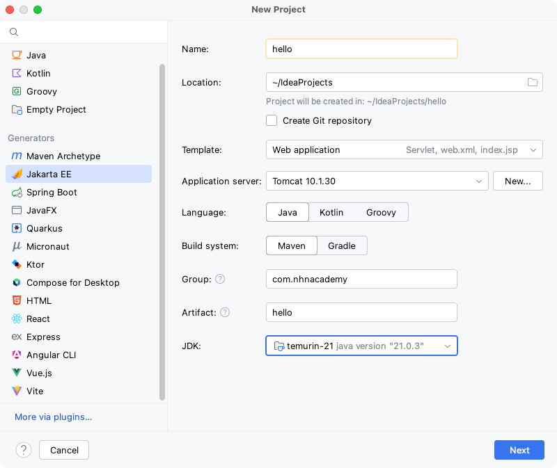

=== Intellij에서 maven 프로젝트 생성

* New Project -> Jakarta EE
** Template : Web Application
** Language : Java
** Build System : Maven
** Group, Artifact 설정
** JDK : jdk11, Temurin-11

* Java EE version 
** *Java EE 8 선택*

=== pom.xml 설정

* jakarta.servlet-api 의존성 추가

[source,xml]
----
<dependencies>
    <dependency>
        <groupId>jakarta.servlet</groupId>
        <artifactId>jakarta.servlet-api</artifactId>
        <version>4.0.4</version>
        <scope>provided</scope>
    </dependency>
</dependencies>

----

* maven-war-plugin 설정 ( 빌드플러그인 )
* packaging : war

[source,xml]
----
<packaging>war</packaging>
<build>
    <plugins>
        <plugin>
            <groupId>org.apache.maven.plugins</groupId>
            <artifactId>maven-war-plugin</artifactId>
            <version>3.3.2</version>
            <configuration>
                <warSourceDirectory>src/main/webapp</warSourceDirectory>
                <failOnMissingWebXml>false</failOnMissingWebXml>
            </configuration>
        </plugin>
    </plugins>
</build>
----

* 최종 pom.xml

[source,xml]
----
<?xml version="1.0" encoding="UTF-8"?>
<project xmlns="http://maven.apache.org/POM/4.0.0"
     xmlns:xsi="http://www.w3.org/2001/XMLSchema-instance"
     xsi:schemaLocation="http://maven.apache.org/POM/4.0.0 http://maven.apache.org/xsd/maven-4.0.0.xsd">
    <modelVersion>4.0.0</modelVersion>

    <groupId>com.nhnacademy</groupId>
    <artifactId>hello</artifactId>
    <version>1.0-SNAPSHOT</version>

    <properties>
        <maven.compiler.source>11</maven.compiler.source>
        <maven.compiler.target>11</maven.compiler.target>
        <project.build.sourceEncoding>UTF-8</project.build.sourceEncoding>
    </properties>

    <packaging>war</packaging>

    <dependencies>
        <dependency>
            <groupId>jakarta.servlet</groupId>
            <artifactId>jakarta.servlet-api</artifactId>
            <version>4.0.4</version>
            <scope>provided</scope>
        </dependency>
    </dependencies>

    <build>
        <plugins>
            <plugin>
                <groupId>org.apache.maven.plugins</groupId>
                <artifactId>maven-war-plugin</artifactId>
                <version>3.3.2</version>
                <configuration>
                    <warSourceDirectory>src/main/webapp</warSourceDirectory>
                    <failOnMissingWebXml>false</failOnMissingWebXml>
                </configuration>
            </plugin>
        </plugins>
    </build>

</project>
----
