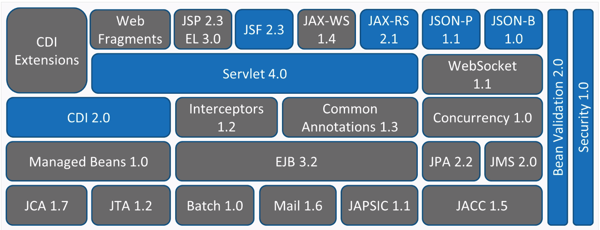

= Jakarta EE?

* Java 언어 플랫폼 중의 하나
* 대용량, 멀티 티어의 엔터프라이즈 애플리케이션을 실행하고 운영할 수 있는 기술과 환경을 제공
* 특정 운영체제와 미들웨어에 종속되지 않고 정보 교환 및 애플리케이션 호환이 가능한 플랫폼을 제공하는 것이 목적

== Jakarta EE 8(Java EE 8 )

Java EE 8 (이미지 출처: oreilly 'Building RESTful Web Services with Java EE 8')

== Jakarta EE 9

Jakarta EE 9(이미지 출처 : https://jakarta.ee/specifications/platform/9/jakarta-platform-spec-9.html)

== Java 언어 플랫폼

* Java 언어로 작성된 프로그램이 실행되는 특정한 환경
* JDK 1.2 부터 시작

== Java 언어 플랫폼의 종류

=== Java SE ( Standard Edition )

* Java 2 Platform, Standard Edition 줄여서 *J2SE* 라고 불렸음
* 일반적인 응용 프로그램 개발 용도

=== Java EE ( Enterprise Edition )

* Java 2 Platform, Enterprise Edition 줄여서 J2EE라고 불렸음
* Java SE를 확장하여 분산 컴퓨팅, 웹서비스와 같은 엔터프라이즈 환경을 지원

=== Java ME( Micro Edition )

* Java 2 Platform, Micro Edition 줄여서 J2ME라고 불렸음
* 임베디드 시스템이나 모바일 디바이스를 위한 개발 환경을 지원

=== JavaFx

* 데스크톱 애플리케이션 및 리치 웹 애플리케이션 개발 환경을 지원
* cf.) Fx = special effects

=== Jakarta EE ?

* 오라클이 2017년 Java EE 8 릴리스를 마지막으로 오픈소스 SW를 지원하는 비영리 단체인 Eclipse 재단에 Java EE 프로젝트를 이관
** https://github.com/jakartaee

==== 오픈 소스 커뮤니티
* Oracle은 더 개방적이고 커뮤니티 주도적인 개발 과정을 촉진하고자 했습니다. Java EE를 Eclipse Foundation으로 이전함으로써 더 넓은 커뮤니티의 참여와 혁신을 가능하게 했습니다.

==== 클라우드 네이티브 개발
* 플랫폼을 현대적인 클라우드 네이티브 개발 관행과 더 밀접하게 맞추기 위한 것이었습니다. Eclipse Foundation의 개방형 거버넌스 모델이 이러한 진화를 더 잘 지원할 수 있다고 판단했습니다.

==== 자원 재배치
* Oracle은 자원을 클라우드 서비스 및 기타 엔터프라이즈 솔루션과 같은 전략적 영역에 재배치하고자 했을 가능성이 큽니다.

==== 생태계 성장
* Java EE를 Eclipse Foundation으로 이전함으로써 Oracle은 엔터프라이즈 Java 생태계 내에서 성장과 채택을 촉진하고자 했습니다. 이는 재단의 광범위한 네트워크와 협력 환경을 활용하기 위함입니다.

|===
|플랫폼 버전 |출시 시기 |비고 

|Jakarta EE 10 |2022-03 |*Jakarta EE 최초의 major release* 
|Jakarta EE 9.1 |2021-05 |JDK 11 지원 
|Jakarta EE 9 |2020-12 |네임스페이스 변경: `jakarta` → `jakarta`
|** Jakarta EE 8 ** |** 2019-09 ** | ** Java EE → Jakarta EE로 복사 **
|Java EE 8 |2017-08 |HTTP/2 
|Java EE 7 |2013-05 |WebSocket, JSON, HTML5 지원 
|===

== Reference

* https://jakarta.ee/specifications/platform/9/jakarta-platform-spec-9.html[jakarta-platform-spec-9]

* https://blogs.oracle.com/javamagazine/post/transition-from-java-ee-to-jakarta-ee[Transition from Java EE to Jakarta EE]