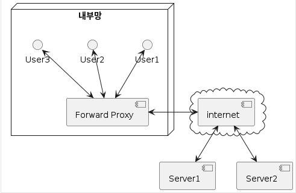
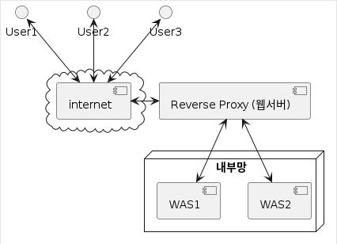
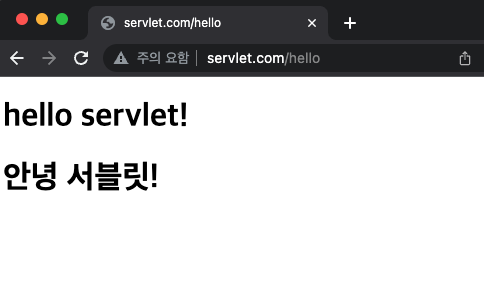

= WAS

== WAS ( Web Application Server )

* 영미권에서는 주로 **(Java) Application Server** 라고 부름
* 주로 정적 웹 콘텐츠를 처리하는 웹서버(apache httpd, nginx)와 구분하기 위한 용도
* Servlet Container(=Web Container), EJB Container 등의 역할을 수행하며
* 동적 웹 콘텐츠를 생성하기 위한 웹 애플리케이션과 서버 환경을 만들어 동작시키는 기능을 제공

=== (Servlet만 한정해서 보면) 흔히 WAS = Servlet Container

=== tomcat

* apache 재단에서 개발한 무료 오픈 소스 WAS(Web Application Server)
* Servlet Container의 reference 구현

=== 사실 Servlet은 API다?!

=== Servlet API

* Java EE 에서는 Servlet API Spec 만 정의
* 실제 구현은 WAS에서 담당
* ex)
** Servlet API: javax.servlet.http.HttpServletRequest interface
** tomcat 구현: org.apache.catalina.connector.Request class

=== servlet-api 의존 라이브러리 scope가 provided인 이유

=== Servlet API

----
javax.servlet
├── RequestDispatcher
├── Servlet                             v 
├── ServletConfig
├── ServletRequest                      v
├── ServletResponse                     v
└── http
    ├── HttpServlet                     v
    ├── HttpServletRequest              v
    ├── HttpServletResponse             v
    ├── HttpSession
    ├── HttpSessionContext
    └── ...

----

== Servlet spec과 tomcat version

https://tomcat.apache.org/whichversion.html

|===
|Servlet Spec |플랫폼 버전 |최소 지원 tomat 버전 

|Servlet 6.0 |Jakarta EE 10 |tomcat 10.1 
|Servlet 5.0 |Jakarta EE 9 |tomcat 10.0 
|Servlet 4.0 |Jakarta EE 8 |tomcat 9.0 
|Servlet 4.0 |Java EE 8 |tomcat 9.0 
|Servlet 3.1 |Java EE 7 |tomcat 8.0 
|Servlet 3.0 |Java EE 6 |tomcat 7.0 
|===

== 정리

=== Servlet

* Java를 사용하여 동적 웹 콘텐츠를 생성하는 서버 측 프로그램
* CGI 단점 해결 → Servlet Container 도입

=== Servlet Container

* Servlet의 생명주기를 관리하고, URL과 특정 서블릿을 맵핑 하며 URL 요청 처리
* Java EE 아키텍처에 속함

=== Java EE

* Java 언어로 엔터프라이즈 애플리케이션을 개발하고 운영할 수 있도록 지원해 주는 플랫폼
* 현재는 Eclipse 재단으로 운영이 넘어가서 Jakarta EE 로 변경됨

=== WAS

* Web Application Server
* = Servlet Container

=== tomcat

* apache 재단에서 만든 WAS 중의 하나
* Servlet Container의 reference 구현
* 사실상, Servlet Container = WAS = tomcat

== 웹서버와 WAS 연동 - Reverse Proxy

=== Proxy

* 자원을 요청하는 클라이언트와
** 자원을 제공하는 서버 사이에서
** 중재자 역할을 하는 서버 프로그램

=== Forward Proxy

* 사용자의 요청을 실제 서버가 직접 받는 것이 아니라
** 중간에서 포워드 프락시 서버가 대신 요청받아 실제 서버에 연결하여 그 결과를 클라이언트에 전달(forward)
* Caching을 통한 성능 향상
* 웹 사용 환경 제한을 통한 보안 강화

=== Reverse Proxy

* 보안상의 이유로 DMZ 존에 웹서버를 두고 Reverse Proxy로 설정하고 WAS는 내부망에 위치시킴
* 상황에 맞게 웹서버나 WAS를 유연하게 늘릴 수 있음

== nginx에 tomcat 연동

* mac
** */usr/local/etc/nginx/servers*
* linux
** /etc/nginx/conf.d/
* 파일 생성

** servlet.com.conf

----
upstream tomcat {
    server 127.0.0.1:8080;
}

server {
    listen 80;
    server_name servlet.com;
    location / {
        proxy_set_header X-Forwarded-For $remote_addr;
        proxy_set_header X-Forwarded-Proto $scheme;
        proxy_set_header Host $http_host;
        proxy_pass http://tomcat;
    }
}
----

* nginx restart

----
sudo brew services restart nginx
----

* hostname 변경
** sudo vi /etc/hosts (추가)

----
127.0.0.1       servlet.com
----

* http://servlet.com/hello

