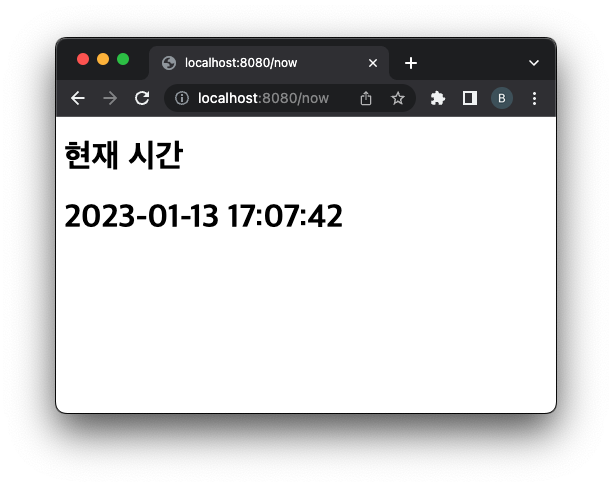

= Servlet 개발

== Servlet Interface

[source,java]
----
public interface Servlet {
    public void init(ServletConfig config) throws ServletException;

    public void service(ServletRequest req, ServletResponse res)
      throws ServletException, IOException;

    public void destroy();

    public ServletConfig getServletConfig();

    public String getServletInfo();
}

----

== Servlet Lifecycle

image:https://docs.oracle.com/cd/E17802_01/products/products/servlet/2.1/orig/introduction.fm.anc.gif[image]
Servlet Lifecycle (이미지 출처: http://oracle.com/[oracle.com]'Java Servlet API Specification')

== 실습

=== Servlet Lifecycle 확인

* 앞서 만든 Servlet 프로젝트에서
* HelloServlet 클래스에 아래 메서드 override
** init(ServletConfig config)
** service(HttpServletRequest req, HttpServletResponse resp)
** destroy()
* super 메서드 호출 전에 log 출력하도록 코드 추가
* 애플리케이션을 실행해서 로그 확인
* HelloServlet.java

[source,java]
----
public class HelloServlet  extends HttpServlet {

    private static Logger log = Logger.getLogger(HelloServlet.class.getName());

    @Override
    protected void doGet(HttpServletRequest req, HttpServletResponse resp) {
        resp.setCharacterEncoding("utf-8");
        try(PrintWriter writer = resp.getWriter()) {
            writer.println("<!DOCTYPE html>");
            writer.println("<html>");
                writer.println("<head>");
                    writer.println("<meta charset='utf-8'>");
                writer.println("</head>");
                writer.println("<body>");
                    writer.println("<h1>hello servlet!</h1>");
                    writer.println("<h1>안녕 서블릿!</h1>");
                writer.println("</body>");
            writer.println("</html>");
        } catch (IOException e) {
            throw new RuntimeException(e);
        }
    }

    @Override
    public void init(ServletConfig config) throws ServletException {
        log.info("before init!");
        super.init(config);
    }

    @Override
    protected void service(HttpServletRequest req, HttpServletResponse resp) throws ServletException, IOException {
        log.info("before service!");
        super.service(req, resp);
    }

    @Override
    public void destroy() {
        log.info("before destroy!");
        super.destroy();
    }
}
----

* Console에 출력되는 로그 확인하기
[source,log]
----
### 생성하는 과정에서 init 호출
13-Jan-2023 16:55:52.434 정보 [http-nio-8080-exec-5] com.nhnacademy.hello.HelloServlet.init before init!
## 서비스를 호출시 실행
13-Jan-2023 16:55:52.435 정보 [http-nio-8080-exec-5] com.nhnacademy.hello.HelloServlet.service before service!
13-Jan-2023 16:56:09.841 정보 [http-nio-8080-exec-7] com.nhnacademy.hello.HelloServlet.service before service!
# tomcat 종료시 실행
/Users/visualp/IdeaProjects/was/apache-tomcat-9.0.62/bin/catalina.sh stop
13-Jan-2023 16:56:16.424 정보 [main] com.nhnacademy.hello.HelloServlet.destroy before destroy!
----

=== 현재 시각을 출력하는 NowServlet 만들기

* NowServlet.java
* URL 맵핑 : /now
* NowServlet.java

[source,java]
----
public class NowServlet extends HttpServlet {
    private static Logger log = Logger.getLogger(NowServlet.class.getName());

    @Override
    protected void doGet(HttpServletRequest req, HttpServletResponse resp){
        resp.setCharacterEncoding("UTF-8");
        DateTimeFormatter dateTimeFormatter = DateTimeFormatter.ofPattern("yyyy-MM-dd HH:mm:ss");

        LocalDateTime localDateTime = LocalDateTime.now();
        String nowDateTimeString = localDateTime.format(dateTimeFormatter);

        try(PrintWriter writer = resp.getWriter()){
            writer.println("<!DOCTYPE html>");
            writer.println("<html>");
                writer.println("<head>");
                    writer.println("<meta charset='utf-8'>");
                writer.println("</head>");
                writer.println("<body>");
                    writer.println("<h1>현재 시간</h1>");
                    writer.println("<h1>"+nowDateTimeString+"</h1>");
                writer.println("</body>");
            writer.println("</html>");
        } catch (IOException e) {
            throw new RuntimeException(e);
        }
    }

    @Override
    public void init(ServletConfig config) throws ServletException {
        log.info("before init!");
        super.init(config);
    }
}
----

* webapp/WEB-INF/web.xml

----
<servlet>
    <servlet-name>nowServlet</servlet-name>
    <servlet-class>com.nhnacademy.hello.NowServlet</servlet-class>
</servlet>

<servlet-mapping>
    <servlet-name>nowServlet</servlet-name>
    <url-pattern>/now</url-pattern>
</servlet-mapping>
----

* http://servlet.com/now[servlet.com/now]  or localhost:8080/now

== load-on-startup

=== Servlet 의 문제점

* Servlet은 브라우저의 최초 요청시 init() 메서드(초기화) 과정을 통해서 메모리에 로드되어 기능을 수행합니다.
** 이는 최초 요청에 대해서 실행시간이 길어질 수 있는 단점이 있습니다.
** 지연 초기화 ( lazy initialization )

=== load-on-startup 특징

* 0보다 크면 tomcat container가 미리 servlet을 초기화 합니다.
* 숫자의 순서에 의해서 초기화 됩니다.
[source,java]
----
<?xml version="1.0" encoding="UTF-8"?>
<web-app xmlns="http://xmlns.jcp.org/xml/ns/javaee"
         xmlns:xsi="http://www.w3.org/2001/XMLSchema-instance"
         xsi:schemaLocation="http://xmlns.jcp.org/xml/ns/javaee http://xmlns.jcp.org/xml/ns/javaee/web-app_4_0.xsd"
         version="4.0">

    <servlet>
        <servlet-name>helloServlet</servlet-name>
        <servlet-class>com.nhnacademy.hello.HelloServlet</servlet-class>
        <load-on-startup>1</load-on-startup>
    </servlet>

    <servlet-mapping>
        <servlet-name>helloServlet</servlet-name>
        <url-pattern>/hello</url-pattern>
    </servlet-mapping>

    <servlet>
        <servlet-name>nowServlet</servlet-name>
        <servlet-class>com.nhnacademy.hello.NowServlet</servlet-class>
        <load-on-startup>2</load-on-startup>
    </servlet>

    <servlet-mapping>
        <servlet-name>nowServlet</servlet-name>
        <url-pattern>/now</url-pattern>
    </servlet-mapping>

</web-app>
----

== Servlet 클래스 계층도

[source,plantuml]
----
@startuml
package javax.servlet {
    Interface Servlet{
    }

    abstract class GenericServlet{
    }

    Servlet <|.. GenericServlet

}

package javax.servlet.http {
    abstract class HttpServlet{

    }
    GenericServlet <|--  HttpServlet
}

package com.nhnacademy.hello {
	class HelloServlet{}
    class NowServlet{}
    HttpServlet <-- HelloServlet
    HttpServlet <-- NowServlet

}
@enduml
----

== GenericServlet 이란?

* http 이외의 프로토콜을 위한 범용 Servlet
** http 프로토콜 → HttpServlet 확장
** http 이외의 프로토콜 → GenericServlet 확장
* abstract class 로서 기본 구현 제공
** Servlet interface 에서 service() 메서드를 제외한 나머지 메서드들에 대한 기본 구현 제공

== HttpServlet.service() method

* 내부적으로 mehtod에 의해서 doXXXX method를 호출.
[source,java]
----
protected void service(HttpServletRequest req, HttpServletResponse resp) throws ServletException, IOException {
    String method = req.getMethod();
    long lastModified;
    if (method.equals("GET")) {
        lastModified = this.getLastModified(req);
        if (lastModified == -1L) {
            this.doGet(req, resp);
        } else {
            long ifModifiedSince = req.getDateHeader("If-Modified-Since");
            if (ifModifiedSince < lastModified) {
                this.maybeSetLastModified(resp, lastModified);
                this.doGet(req, resp);
            } else {
                resp.setStatus(304);
            }
        }
    } else if (method.equals("HEAD")) {
        lastModified = this.getLastModified(req);
        this.maybeSetLastModified(resp, lastModified);
        this.doHead(req, resp);
    } else if (method.equals("POST")) {
        this.doPost(req, resp);
    } else if (method.equals("PUT")) {
        this.doPut(req, resp);
    } else if (method.equals("DELETE")) {
        this.doDelete(req, resp);
    } else if (method.equals("OPTIONS")) {
        this.doOptions(req, resp);
    } else if (method.equals("TRACE")) {
        this.doTrace(req, resp);
    } else {
        String errMsg = lStrings.getString("http.method_not_implemented");
        Object[] errArgs = new Object[]{method};
        errMsg = MessageFormat.format(errMsg, errArgs);
        resp.sendError(501, errMsg);
    }

}
----

== HttpServlet.doXXX() method

[source,java]
----
protected void doGet(HttpServletRequest req, HttpServletResponse resp) /* ... */ {
    // ...
    resp.sendError(getMethodNotSupportedCode(protocol), msg);
}

protected void doPost(HttpServletRequest req, HttpServletResponse resp) /* ... */ {
    // ...
    resp.sendError(getMethodNotSupportedCode(protocol), msg);
}

protected void doPut(HttpServletRequest req, HttpServletResponse resp) /* ... */ {
    // ...
    resp.sendError(getMethodNotSupportedCode(protocol), msg);
}

protected void doDelete(HttpServletRequest req, HttpServletResponse resp) /* ... */ {
    // ...
    resp.sendError(getMethodNotSupportedCode(protocol), msg);
}
----

== Servlet lifecycle 정리

* init() 메서드
** Servlet Container가 Servlet을 생성한 후 초기화 작업을 수행하기 위해 호출
** 클라이언트의 요청을 처리하기 전에 준비할 작업이 있는 경우 여기에서 처리
*** ex.) 데이터베이스 접속, 외부 스토리지 연결, property 로딩 등
* service() 메서드는 굳이 override 할 필요 없음
* GET, POST, PUT, DELETE 각각의 http method 에 대해
** 구현이 필요한 doXXX() 메서드 override 해서 구현
* destroy() 메서드
** Servlet Container가 종료되거나 해당 서블릿을 비활성화시킬 때 호출
** 서비스 수행을 위해 확보되었던 자원 해제, 데이터 저장등의 마무리 작업 시 여기에서 처리
*** ex.) 데이터베이스 연결 종료