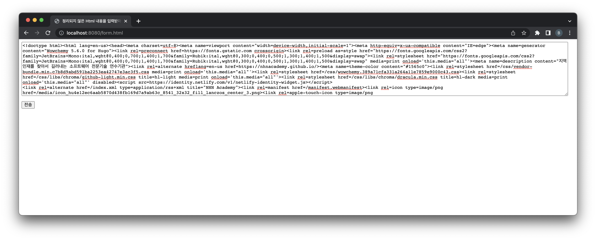

= 실습01-Beautify HTML

== 정리되지 않은 Html 내용을 입력받아 beautify 해서 응답

* Html Form을 위한 파일 생성

** src/main/webapp디렉터리 밑에 beautify.html 파일 생성
* Form Submit을 처리하기 위한 Servlet 생성

* doPost 메서드 구현
* Jsoup 라이브러리 사용
** https://mvnrepository.com/artifact/org.jsoup/jsoup
** groupId: org.jsoup
** artifactId: jsoup

[source,xml]
----
<dependency>
    <groupId>org.jsoup</groupId>
    <artifactId>jsoup</artifactId>
    <version>1.15.3</version>
</dependency>

----

* 테스트
** http://nhnacademy.com[nhnacademy.com]접속
** 페이지 소스 보기

[source,html]
----
<!doctype html><html lang=en-us><head><meta charset=utf-8><meta name=viewport content="width=device-width,initial-scale=1"><meta http-equiv=x-ua-compatible content="IE=edge"><meta name=generator content="Wowchemy 5.6.0 for Hugo"><link rel=preconnect href=https://fonts.gstatic.com crossorigin><link rel=preload as=style href="https://fonts.googleapis.com/css2?family=JetBrains+Mono:ital,wght@0,400;0,700;1,400;1,700&family=Rubik:ital,wght@0,300;0,400;0,500;1,300;1,400;1,500&display=swap"><link rel=stylesheet href="https://fonts.googleapis.com/css2?family=JetBrains+Mono:ital,wght@0,400;0,700;1,400;1,700&family=Rubik:ital,wght@0,300;0,400;0,500;1,300;1,400;1,500&display=swap" media=print onload='this.media="all"'><meta name=description content="지역 인재를 찾아서 길러내는 소프트웨어 전문기술 연수기관"><link rel=alternate hreflang=en-us href=https://nhnacademy.github.io/><meta name=theme-color content="#1565c0"><link rel=stylesheet href=/css/vendor-bundle.min.c7b8d9abd591ba2253ea42747e3ac3f5.css media=print onload='this.media="all"'><link rel=stylesheet href=/css/wowchemy.389a71cfa331a264a11e7859e9000c43.css><link rel=stylesheet href=/css/libs/chroma/github-light.min.css title=hl-light media=print onload='this.media="all"'><link rel=stylesheet href=/css/libs/chroma/dracula.min.css title=hl-dark media=print onload='this.media="all"' disabled>
<link rel=alternate href=/index.xml type=application/rss+xml title="NHN Academy"><link rel=manifest href=/manifest.webmanifest><link rel=icon type=image/png href=/media/icon_hu4e12ec6aab5870d438fb169d7a9ab63c_8541_32x32_fill_lanczos_center_3.png><link rel=apple-touch-icon type=image/png href=/media/icon_hu4e12ec6aab5870d438fb169d7a9ab63c_8541_180x180_fill_lanczos_center_3.png><link rel=canonical href=https://nhnacademy.github.io/><meta property="twitter:card" content="summary"><meta property="og:site_name" content="NHN Academy"><meta property="og:url" content="https://nhnacademy.github.io/"><meta property="og:title" content="NHN 아카데미 | NHN Academy"><meta property="og:description" content="지역 인재를 찾아서 길러내는 소프트웨어 전문기술 연수기관"><meta property="og:image" content="https://nhnacademy.github.io/media/icon_hu4e12ec6aab5870d438fb169d7a9ab63c_8541_512x512_fill_lanczos_center_3.png"><meta property="twitter:image" content="https://nhnacademy.github.io/media/icon_hu4e12ec6aab5870d438fb169d7a9ab63c_8541_512x512_fill_lanczos_center_3.png"><meta property="og:locale" content="en-us"><title>NHN 아카데미 | NHN Academy</title></head><body id=top data-spy=scroll data-offset=70 data-target=#navbar-main class=page-wrapper data-wc-page-id=3976528693a0108357f4928017600865>
<header class=header--fixed><nav class="navbar navbar-expand-lg navbar-light compensate-for-scrollbar" id=navbar-main>

<a class=navbar-brand href=/>NHN Academy</a>
<button type=button class=navbar-toggler data-toggle=collapse data-target=#navbar-content aria-controls=navbar-content aria-expanded=false aria-label="Toggle navigation">
<i class="fas fa-bars"></i></button>
<a class=navbar-brand href=/>NHN Academy</a>

<ul class="navbar-nav d-md-inline-flex"><li class=nav-item><a class=nav-link href=/apply>모집</a></li><li class=nav-item><a class=nav-link href=/#people data-target=#people>멘토</a></li><li class=nav-item><a class=nav-link href=/courses>과정</a></li><li class=nav-item><a class=nav-link href=/#about data-target=#about>위치</a></li><li class=nav-item><a class=nav-link href=/faq>FAQ</a></li></ul>
<ul class="nav-icons navbar-nav flex-row ml-auto d-flex pl-md-2"></ul>
</nav></header>

<section id=slider class="home-section wg-slider carousel slide" data-ride=carousel data-interval=false>

<ol class=carousel-indicators><li data-target=#slider data-slide-to=0 class=active></li><li data-target=#slider data-slide-to=1></li><li data-target=#slider data-slide-to=2></li></ol>

<h1 class=hero-title>NHN 아카데미</h1>
지역의 인재를 찾아서 길러내는 소프트웨어 전문기술 연수기관

<h1 class=hero-title>광주 캠퍼스</h1>
조선대학교 캠퍼스에 마련된 두 번째 둥지

<h1 class=hero-title>경남 캠퍼스</h1>
2022년 3월에 마련된 아카데미의 첫 번째 둥지

<a class=carousel-control-prev href=#slider data-slide=prev>
Previous</a>
<a class=carousel-control-next href=#slider data-slide=next>
Next</a></section><section id=talks class="home-section wg-pages">

</section><section id=people class="home-section wg-people">

<h2><a href=/author/%EB%8F%99%EB%AC%98/>동묘</a></h2><h3>NHN Dooray!</h3>
Java 백엔드 개발

<h2><a href=/author/%EB%9E%9C%EB%94%94/>랜디</a></h2><h3>NHN 아카데미</h3>
데이터베이스

<h2><a href=/author/%EB%A7%88%EB%A5%B4%EC%BD%94/>마르코</a></h2><h3>NHN 아카데미</h3>
Java 백엔드 개발

<h2><a href=/author/%EB%A7%8C%ED%8B%B0/>만티</a></h2><h3>NHN Dooray!</h3>
Java 백엔드 개발

<h2><a href=/author/%EB%B6%80%EB%A6%89/>부릉</a></h2><h3>NHN Dooray!</h3>
Java 백엔드 개발

<h2><a href=/author/%EC%95%84%EC%B9%B4%EB%8D%B0%EB%AF%B8-crew/>아카데미 Crew</a></h2><h3>NHN 아카데미</h3>
Java 백엔드 개발

<h2><a href=/author/%EC%97%91%EC%8A%A4%ED%8A%B8%EB%9D%BC/>엑스트라</a></h2><h3>NHN 아카데미</h3>
IoT

<h2><a href=/author/%EC%BD%A4%ED%8B%B4/>콤틴</a></h2><h3>NHN Dooray!</h3>
Java 백엔드 개발

</section><section id=about class="home-section wg-about">

<h2></h2>
<ul class=network-icon aria-hidden=true><li><a href=https://www.facebook.com/nhnacademy target=_blank rel=noopener aria-label=facebook><i class="fab fa-facebook big-icon"></i></a></li></ul>

경남
<ul><li>50948 경상남도 김해시 내외 중앙로 55, 정우빌딩 5층</li></ul>
광주
<ul><li>조선대학교 IT융합대학 E-SPACE</li></ul>

</section>

<footer class=site-footer>

<ul class=fa-ul><li><i class="fa-li fas fa-building fa-1x" aria-hidden=false></i>
상호: 엔에이치엔아카데미 주식회사</li><li><i class="fa-li fas fa-registered fa-1x" aria-hidden=false></i>
사업자 등록 번호: 532-87-02068 (대한민국)</li><li><i class="fa-li fas fa-store fa-1x" aria-hidden=false></i>
통신 판매업 신고 번호: 제2022-성남분당C-0065호</li><li><i class="fa-li fas fa-phone fa-1x" aria-hidden=true></i>
<a href=tel:031%208038%203159>031 8038 3159</a></li><li><i class="fa-li fas fa-map-marker fa-1x" aria-hidden=true></i>
대왕판교로 645번길 16, 경기도, 성남시, 대한민국 13487</li><li><i class="fa-li fas fa-compass fa-1x" aria-hidden=true></i>
NHN 플레이뮤지엄</li>

<a href=https://forms.gle/1Y57hLpnv4Z3MpaN9>채용 파트너십 신청</a>

<a href=/privacy/>개인정보처리방침</a>
&#183;
<a href=/refund/>환불 규정</a>

© 2021-2023 NHN Academy Corp. All Rights Reserved.
 

<a href=# class=back-to-top><i class="fas fa-chevron-up fa-2x"></i></a>
</footer>

</body></html>
----

* http://localhost:8080/beautify.html

* 한글이 잘 출력될 수 있도록 고려해야 합니다.

image:./images/image-1.png[image.png]