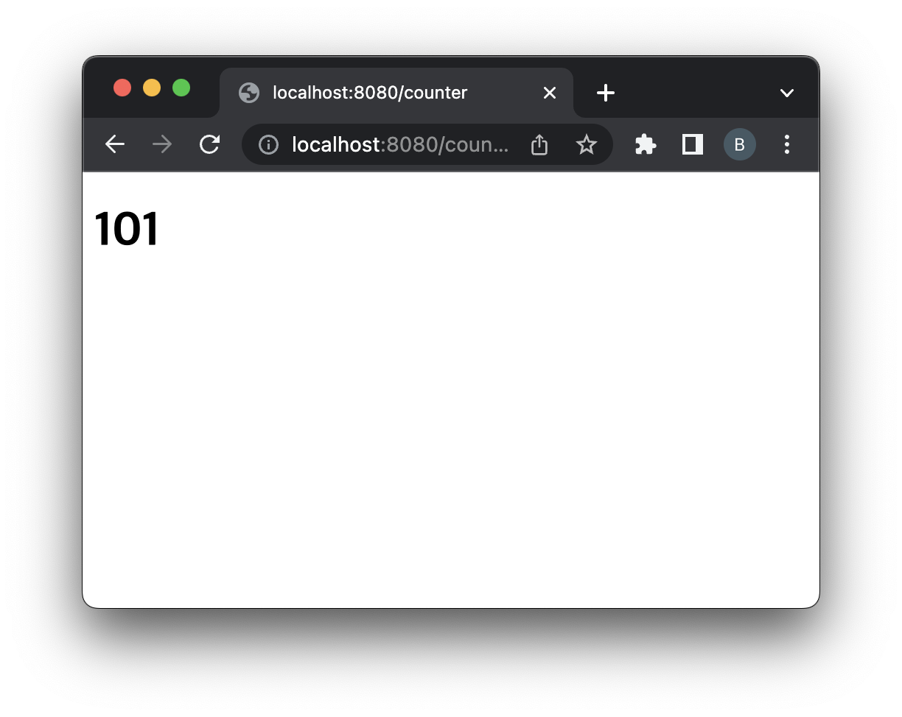

= CounterServlet

== Servlet은 Servlet Container(was == tomcat ) 관리한다는 점을 고려하여 개발합니다.

* 초기화 파라미터 counter를 전달받아 해당 counter 값으로부터 /counter 방문 시 counter를 1씩 증가

** servlet-name: `counterServlet`
** url-pattern: `/counter`
** init-param
*** counter = 100
* /counter

