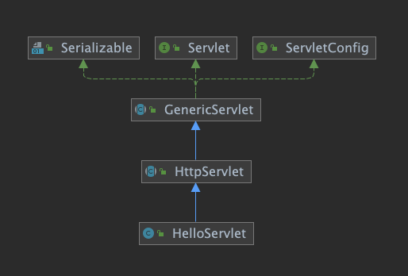
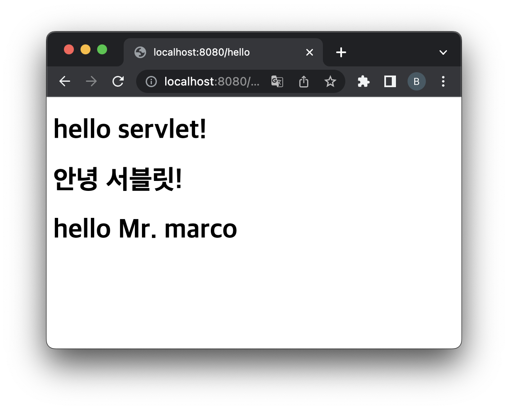

= 초기화 파라미터

== javax.servlet.ServletConfig interface

[source,java]
----
public interface ServletConfig {
    public String getServletName();

    public String getInitParameter(String name);

    public Enumeration<String> getInitParameterNames();

    public ServletContext getServletContext();

}

----

== HelloServlet 에 초기 파라미터 추가

=== web.xml

* init-param
[source,xml]
----
<servlet>
    <servlet-name>helloServlet</servlet-name>
    <servlet-class>com.nhnacademy.hello.HelloServlet</servlet-class>
    <init-param>
        <param-name>title</param-name>
        <param-value>Mr.</param-value>
    </init-param>
    <init-param>
        <param-name>name</param-name>
        <param-value>marco</param-value>
    </init-param>
</servlet>
----

* 아래 초기화 파라미터를 추가해서 `Hello, {title} {name}` 으로 출력
** title: 호칭 (Mr., Ms.)
** name: 이름
* *title, name null이면 default 값을 지정해 주세요!*

