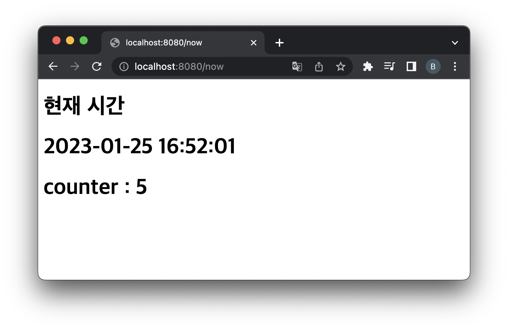

= 방문수 global카운터 Servlet 개발

* 현재 프로젝트에 있는 모든 Servlet을 방문할 때마다 카운터 +1 처리
* http GET method에만 적용
* 다음 API를 활용
* ServletContext.setAttribute(String name, Object object)
* ServletContext.getAttribute(String name)
* CounterUtils.java

[source,java]
----
public final class CounterUtils {
    private CounterUtils() {
        throw new IllegalStateException("Utility class");
    }
    public static void increaseCounter(ServletContext servletContext){
        //....
    }
}
----

* /now

