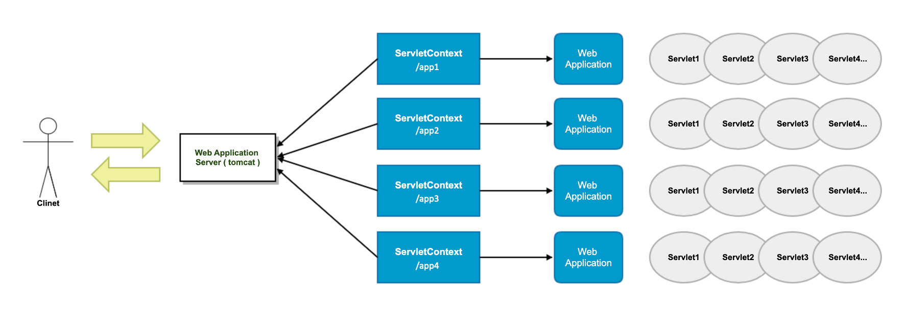
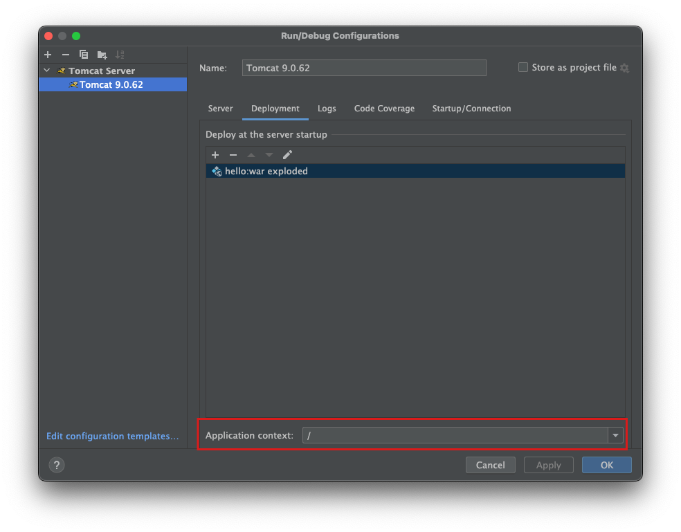

= ServletContext

== Context란?

* 사전적 의미
* 문맥, 상황, 배경
* 소프트웨어 개발에서는 Execution Context의 의미로 많이 사용
* 실행 환경 그 자체 ( runtime )
* 설정 정보 ( Configuration )

== ServletContext 란?

* Servlet Container 실행 환경
* Servlet과 Servlet Container 간에 연동을 위해 사용
* 웹 애플리케이션마다 하나의 ServletContext 생성
* 하나의 웹 애플리케이션에 포함된 Servlet 들은 동일한 ServletContext 공유
* Servlet끼리 자원을 공유하는 데 활용
* Servlet Container 실행 시 생성되고 Servlet Container 종료 시 소멸

=== Application Context = Servlet Context

== ServletContext 기능

* 환경 정보 제공 (context path, servlet version, real path 등)
* 설정 정보 제공 (init param, attribute 등)
* Servlet / Filter / Listener 등록
* Servlet에서의 파일 접근