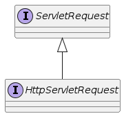

= HttpServletRequest

== Servlet Request Abstraction

* 클라이언트의 요청을 Abstraction

=== ServletRequest API

[source,java]
----
public interface ServletRequest {
    Object getAttribute(String var1);
    void setAttribute(String var1, Object var2);

    String getParameter(String var1);

    Locale getLocale();

    String getContentType();

    int getContentLength();
    long getContentLengthLong();

    BufferedReader getReader() throws IOException;

    ServletInputStream getInputStream() throws IOException;
    //...
}
----

=== HttpServletRequest Api

[source,java]
----
public interface HttpServletRequest extends ServletRequest {
    String getMethod();
    String getPathInfo();
    String getServletPath();
    String getContextPath();
    String getRequestURI();
    StringBuffer getRequestURL();
    String getHeader(String var1);
    Cookie[] getCookies();
    HttpSession getSession(boolean var1);
    HttpSession getSession();
    //...
}
----
