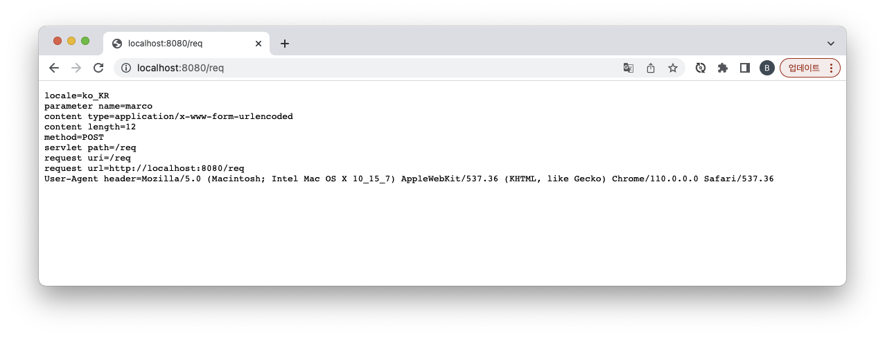

= 실습01-HttpServletRequest API 실습

== Request

----
http://localhost:8080/req.html
----

== req.html

[source,html]
----
<!DOCTYPE html>
<html lang="ko">
<head>
    <meta charset="UTF-8">
    <title>req 테스트</title>
</head>
<body>
<form method="post" action="/req">
  <input type="text" name="userId" value="marco" />
  <button type="submit">전송</button>
</form>

</body>
</html>
----

* Servlet

[source,java]
----
@Override
protected void doPost(HttpServletRequest req, HttpServletResponse resp) throws ServletException, IOException {
    resp.setContentType("text/plain");
    resp.setCharacterEncoding("UTF-8");

    try(PrintWriter out = resp.getWriter()){
        out.println("locale=" + req.getLocale());
        out.println("parameter name=" + req.getParameter("userId"));
        out.println("content type=" + req.getContentType());
        out.println("content length=" + req.getContentLengthLong());
        out.println("method=" + req.getMethod());
        out.println("servlet path=" + req.getServletPath());
        out.println("request uri=" + req.getRequestURI());
        out.println("request url=" + req.getRequestURL());
        out.println("User-Agent header=" + req.getHeader("User-Agent"));
    }catch (Exception e){
        log.error("/req : {}",e.getMessage(),e);
    }
}

----

* web.xml

[source,xml]
----
<servlet-mapping>
    <servlet-name>requestServlet</servlet-name>
    <url-pattern>/req<url-pattern>
</servlet-mapping>

<context-param>
    <param-name>url</param-name>
    <param-value>https://nhnacademy.com</param-value>
</context-param>
----

