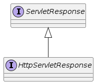

= HttpServletResponse

== Servlet Response Abstraction

== ServletResponse API

[source,java]
----
public void setLocale(Locale loc);

public void setCharacterEncoding(String charset);

public void setContentType(String type);

public void setContentLength(int len);
public void setContentLengthLong(long len);

public PrintWriter getWriter() throws IOException;
public ServletOutputStream getOutputStream() throws IOException;

public void setBufferSize(int size);
public int getBufferSize();
public void flushBuffer() throws IOException;
public void resetBuffer();

public boolean isCommitted();

//...

----

== HttpServletResponse API

[source,java]
----
public void setHeader(String name, String value);
public void addHeader(String name, String value);

public void setStatus(int sc);

public void sendError(int sc, String msg) throws IOException;

public void sendRedirect(String location) throws IOException;

public void addCookie(Cookie cookie);

// ...
----