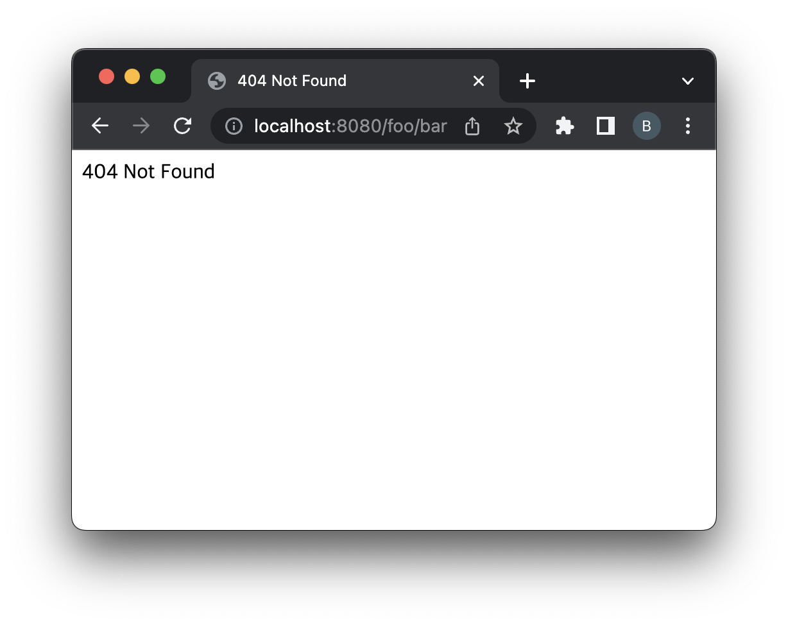

= 실습 01-web.xml

== HttpServletResponse API 실습 프로젝트에서

=== welcome-file-list 지정

* main.html 적용하기
** localhost:8080 -&gt; main.html
* web.xml

[source,xml]
----
<welcome-file-list>
    <welcome-file>/main.html</welcome-file>
</welcome-file-list>

----

* error-page 지정
** /error/404.html

[source,html]
----
<!DOCTYPE html>
<html lang="ko">
<head>
    <meta charset="UTF-8">
    <title>404 Not Found</title>
</head>
<body>
    404 Not Found</body>
</html>
----

* /error/500.html

[source,html]
----
<!DOCTYPE html>
<html lang="ko">
<head>
  <meta charset="UTF-8">
  <title>500 Server Error</title>
</head>
<body>
    500 Server Error
</body>
</html>
----

* web.xml

[source,xml]
----
<error-page>
    <error-code>404</error-code>
    <location>/error/404.html</location>
</error-page>

<error-page>
    <error-code>500</error-code>
    <location>/error/500.html</location>
</error-page>
----

* Test - welcome page
    ** http://localhost:8080
* Test - 404
    ** http://localhost:8080/foo/bar

