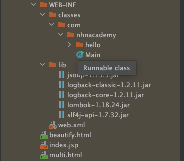

= war ( Web Application Archive)

* 웹 애플리케이션 배포를 위한 패키지

* 참고

** tar (Tape Archive) : Uninx / linux archive utility
** jar ( Java Archive )
** war ( Web application Archive )

____

Maven은 Java 프로젝트를 관리하기 위한 빌드 도구입니다.
Maven은 프로젝트의 라이프 사이클을 정의하고, 프로젝트 빌드와 관련된 여러 작업을 자동화합니다.
Maven에서 WAR(Web ARchive) 빌드는 웹 애플리케이션을 패키징하고 배포할 때 사용됩니다.
WAR 파일은 웹 애플리케이션의 모든 컴포넌트, 설정 파일, 라이브러리 등을 포함하는 파일입니다.

Maven에서 WAR 빌드를 위해서는 pom.xml 파일에 WAR 플러그인을 추가해야 합니다.
WAR 플러그인은 웹 애플리케이션을 빌드하기 위해 필요한 모든 설정을 제공합니다.

WAR 빌드를 수행하려면, Maven 명령어 mvn package를 실행하면 됩니다.
이 명령어는 Maven의 빌드 라이프 사이클 중 "package" 단계를 실행하며, 이 단계에서 WAR 파일을 생성합니다.

WAR 파일은 기본적으로 target 디렉터리 아래에 생성됩니다.
이 파일은 웹 애플리케이션을 배포하기 위해 웹 서버에 복사할 수 있습니다.
웹 서버는 WAR 파일을 읽어 웹 애플리케이션을 배치하고 실행합니다.

____

== 웹 애플리케이션 패키지 디렉터리 구조

* `/WEB-INF/*.` <- 디렉터리 하위는 외부 요청에서 직접 참조 불가
* `/WEB-INF/classes class` <- 파일들 위치
* `/WEB-INF/lib` <- 라이브러리 파일들 위치
* `web.xml`
** 배치 기술자 파일

== maven-war-plugin

* pom.xml의 dependency에 선언된 각종 라이브러리, java class 파일, resources를 모아서 하나의 Web Application Archive 형태의 압축 파일을 생성합니다.

* pom.xml

[source,xml]
----
<build>
    <plugins>
        <plugin>
            <groupId>org.apache.maven.plugins</groupId>
            <artifactId>maven-war-plugin</artifactId>
            <version>3.3.2</version>
            <configuration>
                <warSourceDirectory>src/main/webapp</warSourceDirectory>
                <failOnMissingWebXml>false</failOnMissingWebXml>
            </configuration>
        </plugin>
    </plugins>
</build>
----

* goal
** *war:war*
*** war로 압축된 상태로 배포 ( 사실 확장자만 war일뿐 zip으로 압축되어 있음)
** *war:exploded*
*** 압축이 풀린 상태로 배포
** *war:in-place*
** 소스코드 /src, /target 디렉터리가 함께 생성됩니다.
* *주로 war, exploded를 사용합니다.*