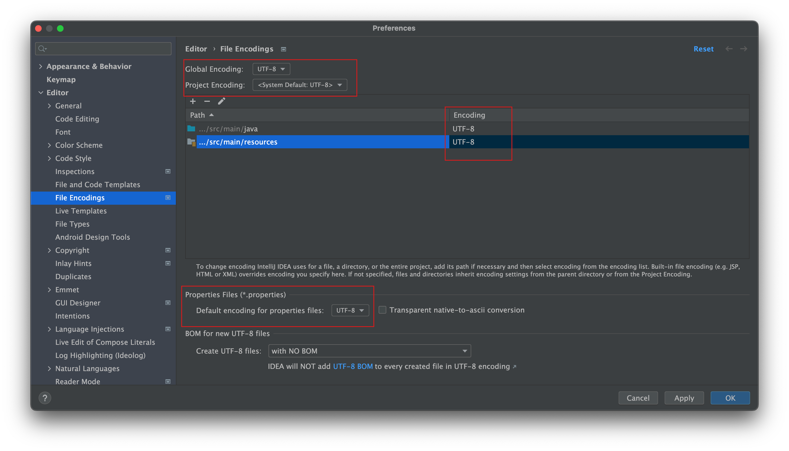
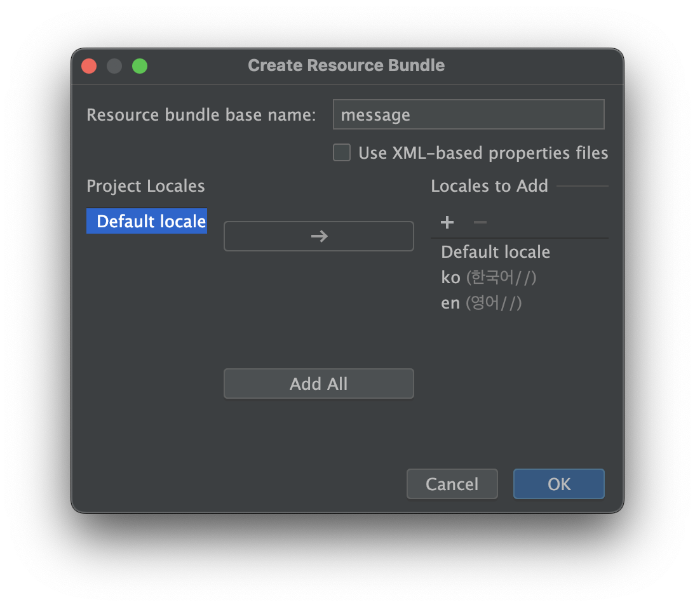
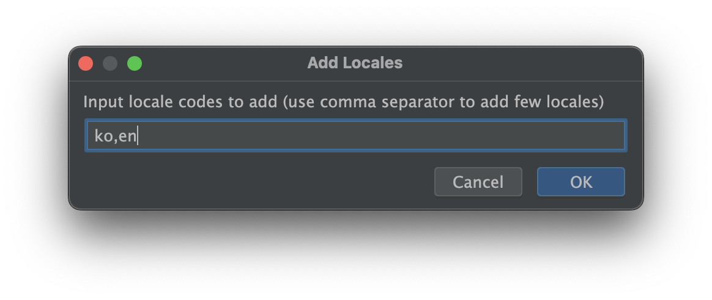
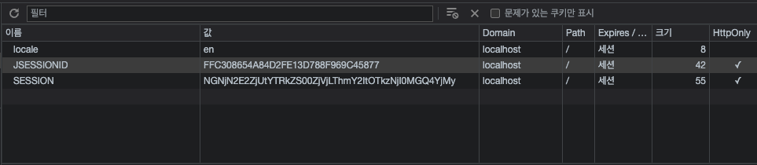

= 실습 01-ResourceBundle + Cookie

== UTF-8 설정

* `Preferences..` -> File Encodings UTF-8 설정

== ResourceBundle + Cookie

* Intellij src/main/resources 디렉터리에서 Resource Bundle 추가
* 컨텍스트 메뉴 -> New -> Resource Bundle
* Resource bundle base name : message
* Locales to Add
** ko : 한국어
** en : 영어

* hello 값 설정하기
* message.properties
** hello=hello
* message_en.properties
** hello=hello
* message_ko.properties
** hello=안녕하세요

== /set-cookie

* parameter
* /set-cookie?locale=ko
* /set-cookie?locale=en
* SetCookieServlet

[source,java]
----
public class SetCookieServlet extends HttpServlet {
    @Override
    protected void doGet(HttpServletRequest req, HttpServletResponse resp) throws ServletException, IOException {

        String locale = req.getParameter("locale");

        if(Objects.isNull(locale)){
            locale = "ko";
        }

        Cookie cookie = new Cookie("locale",locale);
        cookie.setMaxAge(-1);
        cookie.setPath("/");
        resp.addCookie(cookie);

        try(PrintWriter out = resp.getWriter()){
            out.println("OK");
        }
    }
}

----

* web.xml

[source,xml]
----
<servlet>
    <servlet-name>setCookieServlet</servlet-name>
    <servlet-class>com.nhnacademy.hello.SetCookieServlet</servlet-class>
</servlet>

<servlet-mapping>
    <servlet-name>setCookieServlet</servlet-name>
    <url-pattern>/set-cookie</url-pattern>
</servlet-mapping>

----

== /read-cookie

* Cookie에 저장된 locale 값을 이용해서 Resource Bundle에서 해당 locale의 메시지 읽어오기

[source,java]
----
ResourceBundle.getBundle("message", new Locale(locale))
              .getString(messageKey);

----

* ReadCookieServlet.java

[source,java]
----
public class ReadCookieServlet extends HttpServlet {
    @Override
    protected void doGet(HttpServletRequest req, HttpServletResponse resp) throws ServletException, IOException {
        Cookie cookie = CookieUtils.getCookie(req,"locale");

        if(Objects.isNull(cookie)){
            resp.sendError(500,"cookie not found");
            return ;
        }

        String locale = cookie.getValue();

        String helloValue = ResourceBundle.getBundle("message", new Locale(locale)).getString("hello");

        resp.setContentType("text/plain");
        resp.setCharacterEncoding("UTF-8");
        try(PrintWriter out = resp.getWriter()){
            out.println(helloValue);
        }

 }

----

* web.xml

[source,xml]
----
<servlet>
    <servlet-name>readCookieServlet</servlet-name>
    <servlet-class>com.nhnacademy.hello.ReadCookieServlet</servlet-class>
</servlet>

<servlet-mapping>
    <servlet-name>readCookieServlet</servlet-name>
    <url-pattern>/read-cookie</url-pattern>
</servlet-mapping>

----

== locale.html

[source,html]
----
<!DOCTYPE html>
<html>
    <head>
        <meta charset="UTF-8">
        <title>read-cookie-test</title>
    </head>
    <body>
        <ol>
            <li><a href="/set-cookie?locale=ko">ko</a></li>
            <li><a href="/set-cookie?locale=en">en</a></li>
            <li><a href="/read-cookie">/read-cookie</a></li>
        </ol>
    </body>
</html>

----

== Chrome - cookie 확인

* mouse right click -&gt; 검사 -&gt; application -&gt; cookie

== JavaScript를 이용한 cookie 생성

* locale.html에 쿠키생성 버튼을 만들고, myName, myAge가 cookie로 등록하기

* 등록된 cookie는 /read-cookie에서 읽어서 출력하기
** 아래 setCookie 함수를 이용해서 cookie를 생성합니다.

[source,js]
----
function setCookie(name, value, days) {
    let expires = "";
    if (days) {
        const date = new Date();
        date.setTime(date.getTime() + (days * 24 * 60 * 60 * 1000));
        expires = "; expires=" + date.toUTCString();
    }
    document.cookie = name + "=" + value + expires + "; path=/";
}
----

=== cookie 특징
* Browser 내부에 key / value 형태로 데이터를 저장할 수 있다
* Cookie는 만료 기간을 설정할 수 있으며 서버로 전송됨
* `LocalStorage` 는 브라우저 내부에서만 유지되며 서버로 전송되지 않음
