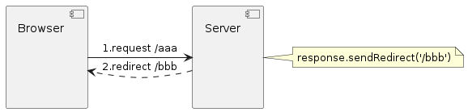
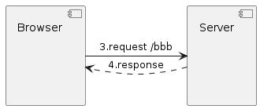
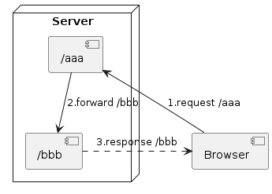

= RequestDispatcher

* 현재의 요청에 대한 정보를 저장했다가
* 다른 자원(Servlet, JSP, HTML 등)으로 전달(forward, include)하는 기능을 제공

----
RequestDispatcher는 같은 웹 애플리케이션 내에서 다른 리소스로 요청을 전달하거나 포함하는 데 사용되는 객체입니다. 
이는 Servlet API의 일부이며 웹 애플리케이션에서 Model-View-Controller (MVC) 아키텍처를 구현하는 데 일반적으로 사용됩니다.

RequestDispatcher 인터페이스는 forward()와 include() 두 가지 메서드를 제공합니다. 
 - forward() 메서드는 JSP 페이지와 같은 다른 리소스로 제어를 전송하는 데 사용되며, 
 - include() 메서드는 다른 리소스의 출력을 현재 페이지의 출력에 포함시키는 데 사용됩니다.

즉, RequestDispatcher는 다른 페이지나 서블릿으로 현재 요청을 보내거나 다른 페이지나 서블릿의 출력을 현재 페이지에 포함시키는 데 사용됩니다. 
이를 통해 웹 애플리케이션에서 유연한 처리가 가능해지며, 코드의 재사용성이 높아집니다.

----

== javax.servlet.RequestDispatcher

[source,java]
----
public interface RequestDispatcher {
    public void forward(ServletRequest request, ServletResponse response) /* .. */;
    public void include(ServletRequest request, ServletResponse response) /* .. */;

    // ...
}
----

== RequestDispatcher 사용법

=== *ServletContext로부터 RequestDispatcher 생성*

----
// `<servlet-name>`
RequestDispatcher rd = getServletContext().getNamedDispatcher("loginServlet");
----

----
// URL
RequestDispatcher rd = getServletContext().getRequestDispatcher("/login");
----

=== *HttpServletRequest로부터 RequestDispatcher 생성*

[source,java]
----
RequestDispatcher rd = request.getRequestDispatcher("/login");
----

=== *RequestDispatcher 사용*

[source,java]
----
rd.forward(request, response);
----

[source,java]
----
rd.include(request, response);
----

== rd.forward() vs response.sendRedirect()

== response.sendRedirect()

* 2번 -> Http Status Code : 302 응답
* 3번 -> Browser는 서버로부터 *응답받은 코드(302)* 확인하고 /bbb로 요청을 보냄.
* 즉 새로운 페이지 /bbb로 이동함. ( Browser에서 주소 확인시 /bbb로 확인됨 )

* cf) http status code 3xx
** https://developer.mozilla.org/ko/docs/Web/HTTP/Status/301[301 - 지정된 url로 이동, window=_blank]
** https://developer.mozilla.org/ko/docs/Web/HTTP/Status/302[302  - 지정된 url로 일시적으로 이동,window=_blank]

* *Request*

[source,httprequest]
----
POST /login HTTP/1.1
Host: localhost:8080

id=admin&pwd=1
----

* *Response*
[source,httprequest]
----
HTTP/1.1 301 Moved Permanently
Location: http://localhost:8080/login
----

== rd.forward()

* 1./aaa 요청을 처리하고 HttpServletRequest, HttpServletResponse 생성됨
* 2./bbb 에 /aaa 에서 생성된 HttpServletRequest와 HttpServletResponse 보냄
* 3./bbb 는 요청을 처리하고 Browser에 응답.
* 즉 새로운 페이지 /bbb로 이동하지 않고 /aaa로 유지 합니다.
* */aaa 요청했던 데이터가 유지됩니다.*
** *로그인 이라면 id, password 등 form으로 넘어온 데이터가 유지됩니다.*
* *redirect와 동작방식은 비슷하지만 서버에서 동작합니다.*

