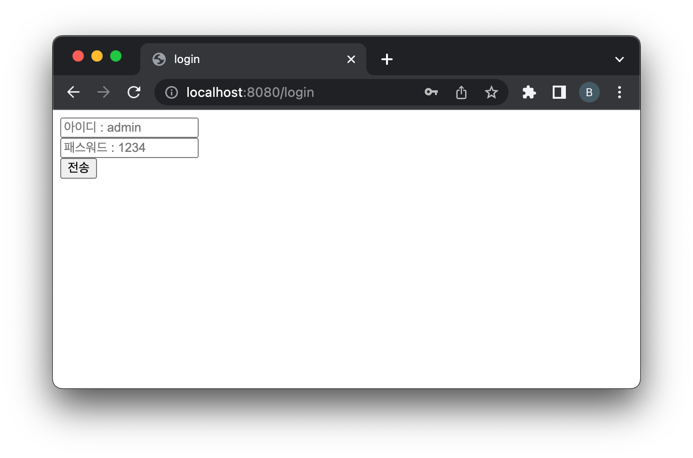

= 로그인,로그아웃 실습 rd.forward적용 하기

* response.sendRedirect()를
** 로그인 실패시 rd.forward()로 다 바꿔보자.

== LoginServlet - Post

----
@Override
protected void doPost(HttpServletRequest req, HttpServletResponse resp) throws ServletException, IOException {
    String id = req.getParameter("id");
    String pwd = req.getParameter("pwd");

    if(initParamId.equals(id) && initParamPwd.equals(pwd)){
    	//session 있으면 가져오고 없으면 생성
        HttpSession session = req.getSession();
        session.setAttribute("id",id);
        resp.sendRedirect("/login");
    }else{
    	log.error("아이디/패스워드가 일치하지 않습니다.");
        //resp.sendRedirect("/login.html");
        RequestDispatcher rd = req.getRequestDispatcher("/login.html");
        rd.forward(req,resp);
        log.error("id:{}",id);
    }
}

----

== 브라우저에서 새로고침

* 로그인 실폐시 새로고침 실행

== log

[source,txt]
----
//처음 로그인 실폐시
18:00:21.796 [http-nio-8080-exec-2] ERROR com.nhnacademy.hello.login.LoginServlet - 아이디/패스워드가 일치하지 않습니다.
18:00:21.796 [http-nio-8080-exec-2] ERROR com.nhnacademy.hello.login.LoginServlet - id:admin
//새로고침
18:00:39.468 [http-nio-8080-exec-4] ERROR com.nhnacademy.hello.login.LoginServlet - 아이디/패스워드가 일치하지 않습니다.
18:00:39.469 [http-nio-8080-exec-4] ERROR com.nhnacademy.hello.login.LoginServlet - id:admin
----

== 무슨일이 일어나는가?

* *browser에 새로고침 -&gt; request 객체가 유지됨.*
** log에 id가 출력되는것을 확인할 수 있음.