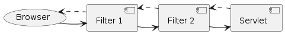

= Servlet Filter

* 지정한 URL 패턴에 해당하는 요청에 대해
** 서블릿 실행 전 후에
** 해당 요청이나 응답에 공통적으로 적용할 작업을 수행하는 객체
* 필터 체인 형태로 제공

----
Servlet Filter는 Java Servlet API에서 제공하는 기능 중 하나로, 
HTTP 요청과 응답을 처리하기 전에 그 사이에서 추가적인 처리를 수행할 수 있도록 해주는 컴포넌트입니다.

Filter는 일종의 체인 형태로 동작합니다.
클라이언트가 서버에 요청을 보내면, 이 요청은 Filter 체인의 맨 앞에서부터 순차적으로 각 Filter를 거치며 필터링됩니다.
필터링은 일반적으로 요청과 응답의 헤더와 바디를 수정하거나, 인증과 권한 부여를 위한 처리, 요청과 응답에 대한 로깅 등의 작업을 수행합니다.

Filter는 다음과 같은 장점을 제공합니다.
- 중복 코드 제거: 여러 서블릿에서 공통으로 사용되는 코드를 Filter로 분리하여 중복을 제거할 수 있습니다.
- 보안 강화: Filter를 이용하여 모든 요청에 대한 보안 검사나 인증 처리 등을 통합적으로 수행할 수 있습니다.
- 코드 가독성 향상: 서블릿 코드에서 비즈니스 로직과 관계 없는 처리를 Filter로 분리하여 코드 가독성을 향상시킬 수 있습니다.

Filter는 javax.servlet.Filter 인터페이스를 구현하여 작성됩니다.
또한 web.xml 파일에서 필터의 매핑과 순서를 설정할 수 있습니다.
최근에는 @WebFilter 어노테이션을 사용하여 필터를 등록하는 방법도 제공됩니다.

----

== Interface

=== javax.servlet.Filter

[source,java]
----
public interface Filter {
    default public void init(FilterConfig filterConfig) throws ServletException {}

    public void doFilter(ServletRequest request, ServletResponse response, FilterChain chain) /* .. */;

    default public void destroy() {}
}
----

=== javax.servlet.FilterChain interface

[source,java]
----
public interface FilterChain {
    public void doFilter(ServletRequest request, ServletResponse response) /* .. */;
}
----

=== javax.servlet.FilterConfig

[source,java]
----
public interface FilterConfig {
    public String getFilterName();

    public ServletContext getServletContext();

    public String getInitParameter(String name);
    public Enumeration<String> getInitParameterNames();
}
----