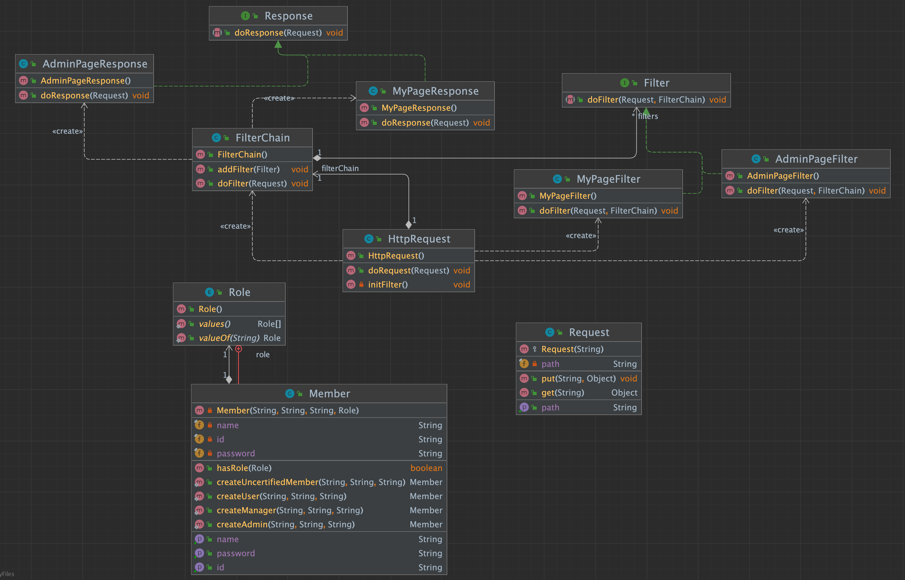

= 책임 연쇄 패턴(chain-of-responsibility pattern)

* 객체 지향 디자인에서 chain-of-responsibility pattern은 명령 객체와 일련의 처리 객체를 포함하는 디자인 패턴이다.
* 각각의 처리 객체는 명령 객체를 처리할 수 있는 연산의 집합이고, 체인 안의 처리 객체가 핸들할 수 없는 명령은 다음 처리 객체로 넘겨진다.
* 이 작동방식은 새로운 처리 객체부터 체인의 끝까지 다시 반복된다.

== 권한체크 실습 ( 직접 구현하기 )

* Http 페이지 요청에 대해서 권한 체크를 합니다.
* 권한체크는 체이닝된 필터들로 구성되어 있습니다.
* MyPageCheckFilter : /mypage 경로에 대해서 권한체크를 합니다.
** Member.ROLE : USER 접근할 수 있습니다.
* AdminCheckFilter : /admin 경로에 대해서 권한체크를 합니다.
** Member.ROLE : Admin 접근할 수 있습니다.

== Reference
* https://ko.wikipedia.org/wiki/%EC%B1%85%EC%9E%84_%EC%97%B0%EC%87%84_%ED%8C%A8%ED%84%B4[wiki, Chain-of-responsibility pattern]
