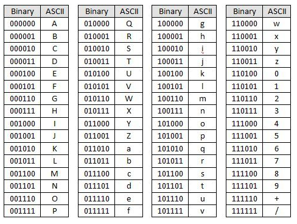

= &lt;form&gt;

== HTML

[source,html]
----
<form method='post' action='/login' enctype=''>
<!-- ... -->
</form>

----

== enc-type : HTML form content-type

* 폼 데이터가 서버로 제출될 때 해당 데이터가 인코딩되는 방법을 명시합니다.
* method='post' 일 때만 사용할 수 있음

=== *속성값*

* *application/x-www-form-urlencoded*
** default
** key=value&amp;key=value&amp;…
** 모든 데이터(문자)은 서버로 보내기 전에 인코딩됨을 명시함.
* *multipart/form-data*
** 모든 문자를 인코딩하지 않음을 명시함.
** 파일이나 ASCII가 아닌 문자열, 바이너리 데이터 전송 시 multipart/form-data를 사용
** multipart/form-data의 컨텐트는 multipart MIME 데이터의 모든 규칙을 따름
* text/plain
** 공백 문자(space)는 "+" 기호로 변환하지만, 나머지 문자는 모두 인코딩되지 않음을 명시함.

== *MIME (Multipurpose Internet Mail Extensions)*

* 전자 우편을 위한 인터넷 표준 포맷
* 이메일 메세지의 형식을 확장해서
** ASCII 이외의 문자셋으로 표현된 텍스트를 지원하고
** 오디오, 비디오, 이미지, 애플리케이션 프로그램 등을 첨부할 수 있도록 하기 위한
** 인터넷 표준
* MIME 형식의 이메일 메세지는 SMTP나 POP, IMAP과 같은 표준 프로토콜로 전송

----

MIME(Multipurpose Internet Mail Extensions) 타입은 웹에서 파일의 형식을 구분하기 위해 사용됩니다.

자주사용하는 MIME TYPE

- text/html : HTML 문서를 나타내는 MIME 타입입니다. 웹 브라우저에서 HTML 문서를 받을 때 사용됩니다.
- text/plain : 일반 텍스트를 나타내는 MIME 타입입니다. 예를 들어, 서블릿에서 출력하는 일반 텍스트 메시지를 브라우저에서 받을 때 사용됩니다.
- image/jpeg : JPEG 형식의 이미지를 나타내는 MIME 타입입니다. 웹 페이지에서 이미지를 보여줄 때 사용됩니다.
- image/png : PNG 형식의 이미지를 나타내는 MIME 타입입니다. JPEG 대신 PNG를 사용하면 이미지의 투명도와 압축률이 더 좋아지는 등의 이점이 있습니다.
- application/pdf : PDF 문서를 나타내는 MIME 타입입니다. 웹 페이지에서 PDF 문서를 보여줄 때 사용됩니다.
- application/json : JSON 데이터를 나타내는 MIME 타입입니다. 웹 페이지에서 JSON 데이터를 전송하거나 받을 때 사용됩니다.
- application/xml : XML 데이터를 나타내는 MIME 타입입니다. 웹 페이지에서 XML 데이터를 전송하거나 받을 때 사용됩니다.
- application/octet-stream : 이진 파일을 나타내는 MIME 타입입니다. 예를 들어, 파일 다운로드 기능을 구현할 때 사용됩니다.

위와 같은 MIME 타입은 서블릿과 JSP에서 응답(Response)을 생성할 때 Content-Type 헤더에 설정하여 클라이언트(웹 브라우저)가 올바르게 인식하도록 해야 합니다.
----

== Multipart Message

* MIME의 메세지 바디는 multipart (여러 개의 part) 로 구성되어 있다
[source,text]
----
MIME-Version: 1.0
Content-Type: multipart/mixed; boundary=frontier

This is a message with multiple parts in MIME format.
--frontier
Content-Type: text/plain

This is the body of the message.
--frontier
Content-Type: application/octet-stream
Content-Transfer-Encoding: base64

PGh0bWw+CiAgPGhlYWQ+CiAgPC9oZWFkPgogIDxib2R5PgogICAgPHA+VGhpcyBpcyB0aGUg
Ym9keSBvZiB0aGUgbWVzc2FnZS48L3A+CiAgPC9ib2R5Pgo8L2h0bWw+Cg==
--frontier--
----

https://en.wikipedia.org/wiki/MIME#Multipart_messages

== boundary

* MIME multipart 메세지는 Content-type 헤더에 boundray를 가지고 있음
* boundary가 메세지의 시작과 끝, 그리고 part들 사이에 위치해서 part들을 구분해줌

== part

* 각각의 part는 자체 헤더와 바디를 가짐
* multipart 컨텐츠는 중첩 구조를 가질 수 있음

== Base64 Encoding?

* Binary Data를 Text로 바꾸는 Encoding
* 파일업로드시 Binary Data를 text로 변경하여 part 내 body에 포함하여 전송합니다.

=== base64 인코딩표

