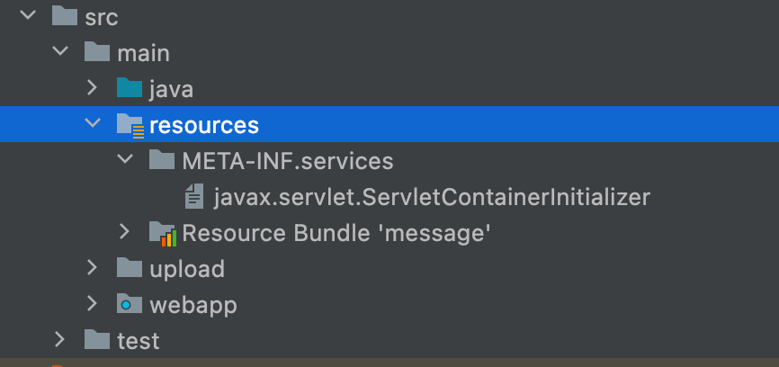

= Servlet 3.0 Annotation

* @WebServlet
* @WebInitParam
* @WebFilter
* @WebListener
* @MultipartConfig

== *@WebServlet*

=== **FileUploadServlet **

* Web.xml
** &lt;servlet&gt;, &lt;servlet-mapping&gt;제거
* @WebServlet 추가
[source,java]
----
@Slf4j
@WebServlet(name = "fileUploadServlet", urlPatterns = "/file/fileUpload")
public class FileUploadServlet extends HttpServlet {
    // ...
}

----

=== *@WebInitParam*

=== *LoginServlet*

* web.xml
** &lt;servlet&gt;, &lt;servlet-mapping&gt;제거
** @WebServlet 추가
*** @WebInitParam

[source,java]
----
@WebServlet(
        name = "loginServlet", 
        urlPatterns = "/login",
        initParams = {
                @WebInitParam(name="id",value = "admin"),
                @WebInitParam(name="pwd",value = "1234"),
        }
)
public class LoginServlet extends HttpServlet {
    // ...
}
----

== @WebFilter

=== *CharacterEncodingFilter*

* web.xml
** &lt;filter&gt;, &lt;filter-mapping&gt; 제거
** CharacterEncodingFilter
*** WebFilter 추가 (@WebInitParam)

[source,java]
----
@WebFilter(
        filterName = "characterEncodingFilter",
        urlPatterns = "/*",
        initParams = {
                @WebInitParam(name = "encoding", value = "UTF-8")
        }
)
public class CharacterEncodingFilter implements Filter {
    // ...
}
----

== @WebListener

* web.xml
** &lt;listener&gt; 제거
* ServletContextListener
** @WebListener 추가

[source,java]
----
@WebListener
public class ServletContextListener implements javax.servlet.ServletContextListener {
    // ...
}
----

## <context-param>

### javax.servlet.ServletContainerInitializer interface

* 웹 애플리케이션 초기화 단계에서 프로그램적으로 Servlet, Filter, Listener 등을 등록할 수 있는 인터페이스
* https://docs.oracle.com/javaee/6/api/javax/servlet/ServletContainerInitializer.html
* https://docs.oracle.com/javase/6/docs/technotes/guides/jar/jar.html#Service%20Provider
** 서버가 실행될때 ServletContainerInitializer service provider를 찾은뒤 @HandleTypes 로 정의된 클래스를 실행한다. (servlet 3.0 spec)

[source,java]
----
public interface ServletContainerInitializer {
    public void onStartup(Set<Class<?>> c, ServletContext ctx) throws ServletException;
}
----

== ServletContainerInitializer 구현

=== javax.servlet.ServletContainerInitializer 파일 생성

* resources/META-INF/services 폴더 하위에
** javax.servlet.ServletContainerInitializer 파일 생성
** 파일 내용 : 구현 클래스 FQCN (Fully Qualified Class Name)  - ** 클래스가 속해있는 페키지명을 모두 포함한 이름. **

[source,java]
----
@HandlesTypes(value = {
        javax.servlet.http.HttpServlet.class,
        javax.servlet.Filter.class,
        javax.servlet.ServletContextListener.class,
        javax.servlet.http.HttpSessionListener.class
})
public class WebAppInitializer implements ServletContainerInitializer {
    @Override
    public void onStartup(Set<Class<?>> set, ServletContext servletContext) throws ServletException {
        servletContext.setInitParameter("url","https://nhnacademy.com");
        servletContext.setInitParameter("counterFileName","counter.dat");
    }
}
----

== web.xml 에서 context-param 제거

[source,xml]
----
<context-param>
    <param-name>url</param-name>
    <param-value>https://nhnacademy.com</param-value>
</context-param>
<context-param>
    <param-name>counterFileName</param-name>
    <param-value>counter.dat</param-value>
</context-param>
----

----
ServletContainerInitializer 인터페이스는 Servlet 3.0 버전에서 새롭게 도입된 인터페이스로, 웹 애플리케이션이 시작될 때 서블릿 컨테이너에 의해 호출되는 클래스의 초기화를 담당합니다. 이 인터페이스를 구현하는 클래스는 웹 애플리케이션이 시작될 때 자동으로 호출됩니다.

ServletContainerInitializer 인터페이스는 onStartup() 메서드를 정의하고 있습니다. 이 메서드는 Set<Class<?>> 클래스 목록과 ServletContext 객체를 매개변수로 받습니다. Set<Class<?>>은 ServletContainerInitializer 구현체가 처리할 클래스나 인터페이스의 집합을 지정합니다. ServletContext 객체는 웹 애플리케이션의 ServletContext를 나타냅니다.

@HandlesTypes 애노테이션은 onStartup() 메서드에서 처리할 클래스나 인터페이스를 지정하는 데 사용됩니다. 예를 들어, @HandlesTypes(MyInterface.class)로 지정하면 ServletContainerInitializer 구현체는 MyInterface를 구현한 모든 클래스를 찾아 초기화합니다. 이를 활용해 원하는 타입의 클래스를 찾아 초기화할 수 있습니다.

ServletContainerInitializer는 서블릿 컨테이너의 확장 가능성을 높이고, 전통적인 web.xml 파일을 대체할 수 있는 방법으로 사용됩니다. 이를 통해 프로그래머는 보다 유연하게 웹 애플리케이션을 구성할 수 있습니다.
----