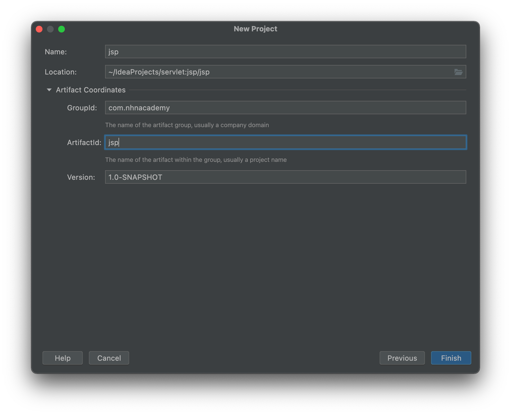
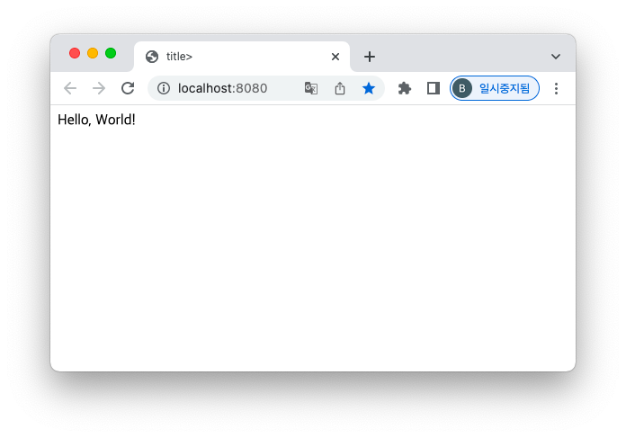

= IntelliJ에서 maven 프로젝트 생성

* project 생성
** GroupId : com.nhnacademy
** Artifactid : jsp

== web.xml

* `welcome-file-list`에 `index.jsp` 추가

[source,xml]
----
<welcome-file-list>
    <welcome-file>index.jsp</welcome-file>
</welcome-file-list>

----

== index.jsp

[source,html]
----
<%@ page contentType="text/html;charset=UTF-8" language="java" %>
<html>
  <head>
    <title><%= "title" %></title>
  </head>
  <body>
    <%= "Hello, World!" %>
     
    <% out.write("Hello, World!"); %>
  </body>
</html>

----

== http://localhost:8080

== 의존성 확인

[source,xml]
----
//servlet - api
<dependency>
    <groupId>jakarta.servlet</groupId>
    <artifactId>jakarta.servlet-api</artifactId>
    <version>4.0.4</version>
    <scope>provided</scope>
</dependency>

//로깅관련...
<dependency>
    <groupId>ch.qos.logback</groupId>
    <artifactId>logback-classic</artifactId>
    <version>1.4.4</version>
</dependency>

<dependency>
    <groupId>org.projectlombok</groupId>
    <artifactId>lombok</artifactId>
    <version>1.18.24</version>
</dependency>
----