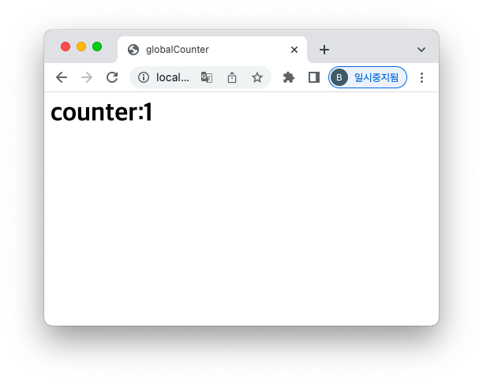

= JSP 문법

== <%@ %>

* `page`: JSP 페이지에 대한 정보

[source,java]
----
<%@ page contentType="text/html;charset=UTF-8" language="java" %>

----

* `include`: JSP 파일 안에 다른 JSP나 HTML 파일을 포함

[source,java]
----
<%@ include file="/some/path/content.html" %>

----

* `tablib`: 태그 라이브러리 선언

[source,java]
----
<%@ taglib uri="http://java.sun.com/jsp/jstl/core" prefix="c" %>

----

== JSP 기본 문법 (Expression)

=== <%= %>

* 변수, 메서드 호출 등 표현식(expression)의 실행 결과를 출력

[source,java]
----
<%= "Hello, World!" %>

----

[source,java]
----
<%= 17 * 5 %>
----

[source,java]
----
<%= request.getParameter('name') %>
----

== JSP 기본 문법 (Declaration)

* 전역변수
** outside the _jspService() method

=== <%! %>

* 변수나 메서드 등을 선언

[source,java]
----
<%! String name = "James" %>
----

[source,java]
----
<%!
    public int minus(int i, int j) {
        return i - j;
    }
%>
----

[source,text]
----
JSP(JavaServer Pages)에서 <%! %>는 선언문(Declaration)을 나타내는 태그입니다. 
이 태그는 JSP 페이지의 전역 범위(Global scope)에서 사용할 수 있는 변수, 메소드, 클래스 등을 선언할 때 사용됩니다.

선언문(Declaration)은 JSP 페이지에서 Java 코드를 작성할 때 사용됩니다.
이 코드는 JSP 페이지를 서블릿(Servlet)으로 변환할 때 전역 범위(Global scope)에 선언됩니다.
따라서 JSP 페이지 내에서 선언한 변수나 메소드는 서블릿에서 사용할 수 있습니다.
----

== JSP 기본 문법 (Scriptlet)

* 지역변수
** inside the _jspService() method.

=== <% %>

* `<%` 와 `%>` 사이에 있는 코드를 실행
[source,java]
----
<%
    int a = 3;
    int b = 2;

    if (a > b) {
        out.println(minus(a, b));
    }
%>
----

== JSP Scriptlet tag vs Declaration tag ?

* 간단한 카운터 예제 만들기

== JSP 제어/반복문

* Scriptlet을 이용

=== if-else

[source,java]
----
<% if (x < 0) { %>
    
negative

<% } else { %>
    
zero or positive

<% } %>
----

=== for, while, do/while

[source,java]
----
<table>
<tr>
<% for (i = 0; i < 10; i++) { %>
    <td><%= i + 1 %></td>
<% } %>
</tr>
</table>
----

== 주석 (comment)

=== content comment

* HTML

[source,java]
----
<!-- comment -->
----

=== JSP comment

* JSP tag

[source,java]
----
<%-- comment --%>
----

=== Scriptlet comment

* Java comment

[source,java]
----
<% /* comment */ %>
----

== Intellij - tomcat work directory

[console,sh]
----
/Users/nhn/IdeaProjects/was/apache-tomcat-9.0.71/bin/catalina.sh run
NOTE: Picked up JDK_JAVA_OPTIONS:  --add-opens=java.base/java.lang=ALL-UNNAMED --add-opens=java.base/java.io=ALL-UNNAMED --add-opens=java.base/java.util=ALL-UNNAMED --add-opens=java.base/java.util.concurrent=ALL-UNNAMED --add-opens=java.rmi/sun.rmi.transport=ALL-UNNAMED
[2023-02-09 02:14:11,208] Artifact jsp:war: Waiting for server connection to start artifact deployment...
[2023-02-09 02:14:11,208] Artifact jsp:war exploded: Waiting for server connection to start artifact deployment...
09-Feb-2023 14:14:11.966 정보 [main] org.apache.catalina.startup.VersionLoggerListener.log 서버 버전 이름:    Apache Tomcat/9.0.71
09-Feb-2023 14:14:11.970 정보 [main] org.apache.catalina.startup.VersionLoggerListener.log Server 빌드 시각:  Jan 9 2023 22:33:01 UTC
09-Feb-2023 14:14:11.970 정보 [main] org.apache.catalina.startup.VersionLoggerListener.log Server 버전 번호:  9.0.71.0
09-Feb-2023 14:14:11.970 정보 [main] org.apache.catalina.startup.VersionLoggerListener.log 운영체제 이름:     Mac OS X
09-Feb-2023 14:14:11.970 정보 [main] org.apache.catalina.startup.VersionLoggerListener.log 운영체제 버전:     11.5.2
09-Feb-2023 14:14:11.971 정보 [main] org.apache.catalina.startup.VersionLoggerListener.log 아키텍처:          x86_64
09-Feb-2023 14:14:11.971 정보 [main] org.apache.catalina.startup.VersionLoggerListener.log 자바 홈:           /Users/nhn/Library/Java/JavaVirtualMachines/temurin-11.0.14.1/Contents/Home
09-Feb-2023 14:14:11.971 정보 [main] org.apache.catalina.startup.VersionLoggerListener.log JVM 버전:          11.0.14.1+1
09-Feb-2023 14:14:11.971 정보 [main] org.apache.catalina.startup.VersionLoggerListener.log JVM 벤더:          Eclipse Adoptium
09-Feb-2023 14:14:11.971 정보 [main] org.apache.catalina.startup.VersionLoggerListener.log CATALINA_BASE:     /Users/nhn/Library/Caches/JetBrains/IntelliJIdea2021.2/tomcat/227194ed-8804-4251-a47d-4f1e27f0fcb9
----

=== CATALINA\_BASE: /Users/nhn/Library/Caches/JetBrains/IntelliJIdea2021.2/tomcat/227194ed-8804-4251-a47d-4f1e27f0fcb9

* **CATALINA\_BASE/work/Catalina/localhost/jsp\_war/org/apache/jsp**

=== 즉 우리가 작성한 jsp 파일은 servlet으로 변경됩니다.
