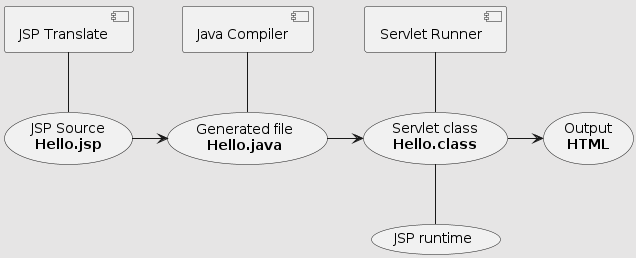

= JSP - 동작구조

* 컨테이너는 JSP 파일을 HttpJspPage 인터페이스를 구현한 서블릿 클래스로 변환하여 생성합니다.

== org.apache.jasper.runtime.HttpJspBase

* https://tomcat.apache.org/tomcat-9.0-doc/api/org/apache/jasper/runtime/HttpJspBase.html
* *HttpServlet을 확장한 class*
 image:/wikis/3209546557912400486/files/3469694455871077565[image.png]

== 주요 api

* jspInit()
** servlet의 init() 메소드에서 호출합니다.
** 재정의 가능
* jspDestory()
** servlet의 Destory() 메소드에서 호출합니다.
** 재정의 가능
* _jspService()
** servlet의 service() 메소드에서 호출합니다.
** 재정의 불가능
*** 우리가 작성한 jsp코드를 받아서 _jspService() method를 만드는 일은 Container를 만드는 벤더가 할일 *(즉 tomcat 에서 알아서할 일)*