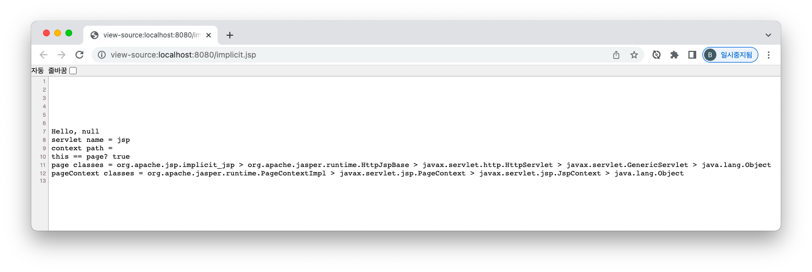
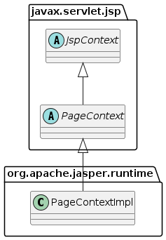

= JSP 내장 객체 실습

* implicit.jsp

[source,java]
----
<%@ page import="java.util.List" %>
<%@ page import="java.util.Collections" %>
<%@ page import="java.util.Objects" %>
<%@ page import="java.util.ArrayList" %>
<%@ page contentType="text/html; charset=UTF-8" trimDirectiveWhitespaces="true" language="java" %>
<%!
    private List<String> getClasses(Class<?> clazz) {
        if (Objects.isNull(clazz)) {
            return Collections.emptyList();
        }

        List<String> classes = new ArrayList<>();
        while (clazz != null) {
            classes.add(clazz.getName());
            clazz = clazz.getSuperclass();
        }

        return classes;
    }
%>
<%
    response.setContentType("text/plain");                                  // response

    out.println("Hello, " + request.getParameter("name"));                  // request
    out.println("servlet name = " + config.getServletName());               // config
    out.println("context path = " + application.getContextPath());          // application

    out.println("this == page? " + (this == page));

    List<String> classes = getClasses(getClass());                          // page
    out.println("page classes = " + String.join(" > ", classes));

    classes = getClasses(pageContext.getClass());                           // pageContext
    out.println("pageContext classes = " + String.join(" > ", classes));
%>

----

== trimDirectiveWhitespaces를 false로 하면?

* trimDirectiveWhitespaces = true -&gt; 선언에 대한 공백제거

== page

* jsp -> 생성된 Servlet class 자체
** https://tomcat.apache.org/tomcat-9.0-doc/api/org/apache/jasper/runtime/PageContextImpl.html

== PageContext 내장객체 ( Jsp Context API )

* https://javaee.github.io/javaee-spec/javadocs/javax/servlet/jsp/PageContext.html?is-external=true

[source,java]
----
abstract public Object getAttribute(String name, int scope);
abstract public void setAttribute(String name, Object value, int scope);

abstract public JspWriter getOut();

// ...
----