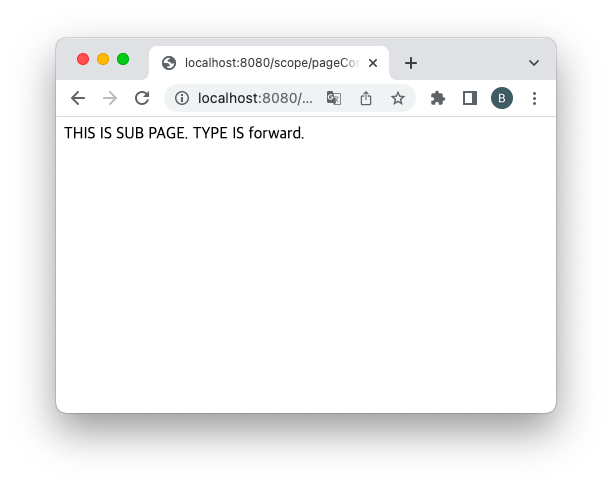

= 실습 - forward vs include

== pageContext.jsp

[source,java]
----
<%@ page contentType="text/html;charset=UTF-8" language="java" %>
<html>
    <head>
        <title> forward vs include </title>
    </head>
    <body>
        <h1>THIS IS pageContext.jsp.</h1>

        <%
            String type = request.getParameter("type");
            if ("include".equals(type)) {
                pageContext.include("sub.jsp");
            } else if ("forward".equals(type)) {
                pageContext.forward("sub.jsp");
            } else {
                out.println("type parameter is needed.");
            }
        %>

    </body>
</html>

----

== sub.jsp

----

THIS IS SUB PAGE. TYPE IS <%= request.getParameter("type") %>.

----

== 다음 두 요청의 차이점은?

* /pageContext.jsp?type=include
** *include는 해당 URL로 제어권을 넘기지만 include처리가 끝나면 다시 제어권은 원래의 페이지로 돌아옴 ( 즉 해당 페이지에 삽입하는것과 같음 )*

* /pageContext.jsp?type=forward
** *forward는 요청과 응답에 대한 제어권을 URL로 지정된 주소로 영구적으로 넘김. -&gt; 종료*

