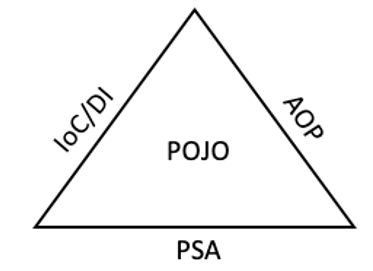

= Java Beans

* 객체 지향 프로그래밍의 가장 큰 이점 중 하나는 다른 프로그램에서도 객체를 다시 사용할 수 있다는 것입니다.
* 예를 들어 워드프로세서에서 동작하는 맞춤법 검사프로그램을 만들었다면 이메일 프로그램에서도 그 객체를 사용할 수 있어야 합니다.
* 자바빈은 자바빈 규격이라는 엄격한 지침을 따라서 다른 객체와 아주 쉽게 쓰일 수 있게 됩니다.
* 즉  Java Beans는 java로 작성된 재사용 가능한 소프트웨어 컴포넌트입니다.

== POJO ( Plain Old Java Object )

* 2000년 9월에 마틴 파울러,레베카 파슨, 조쉬 맥킨지 등이 사용하기 시작한 용어 입니다.
* 특정 기술과 환경에 종속되어 의존하게 된 자바 코드는 가독성이 떨어져 유지보수가 어렵고 확장성이 매우 떨어지는 단점이 있었습니다.
* 이는 객체지향 언어인 자바가 객체지향의 장점을 잃어버리게 되는 것입니다.
* 그래서 POJO라는 개념이 등장했습니다.

https://martinfowler.com/bliki/POJO.html

____

POJO는 주요 JAVA 오브젝트 모델, 컨벤션 또는 프레임워크를 따르지 않는 Java 오브젝트를 의미합니다.

____

== POJO 조건

* 특정 규약에 종속되지 않는다.
** java 언어와 꼭 필요한 API 외에는 종속되지 말아야 합니다.
* *특정 환경에 종속되지 않습니다.*
** 특정 기업의 프레임워크나 서버에서 동작하는 코드라면 POJO라고 할 수 없습니다.
** 예를 들어 POJO는 웹 관련된 (HttpServletRequest, HttpServletResponse ) 즉 특정 환경에 종속적인 기술을 담고 있는 인터페이스나 클래스를 사용해서는 안 됩니다.
* *객체 지향적 원리에 충실해야 합니다.*
** POJO는 객체 지향적인 자바언어의 기본에 충실하게 만들어져야 합니다.
** 자바 문법을 사용했다고 해서 객체지향 프로그래밍과 객체지향 설계가 적용되었다고 볼 수 없습니다.
** 책임과 역할이 각기 다른 코드를 한 클래스에 몰아넣어 덩치 큰 만능 클래스를 만들고 상속과 다형성의 적용이 아닌 if/switch 문으로 가득 설계된 오브젝트라면 POJO라고 부를 수 없습니다.

== POJO 장점

* 깔금한 코드
* 간편한 테스트
* 객체지향적인 설계
* 객체지향 프로그램은 복잡한 도메인을 가진 곳에서 효과적으로 사용될 수 있습니다.

== POJO 프레임워크

* POJO 프레임워크란 POJO 프로그래밍이 가능하도록 기술적인 기반을 제공하는 프레임워크 입니다.
* 스프링 프레임워크가 대표적인 POJO 프레임워크 입니다. 스프링 프레임워크를 이용하면 POJO프로그래밍의 장점을 살려 복잡한 비지니스 핵심 로직을 객체
 지향적인 POJO기반으로 깔끔하게 구현할 수 있습니다.
* 엔터프라이즈 환경에서의 각종 서비스와 기술적인 필요를 POJO방식으로 만들어 코드에 적용할 수 있습니다.

=== Springframework의 주요기술인 IoC, ,DI, AOP, PSA 기술들을 이용해서 POJO로 개발할 수 있게 해주는 기능 기술입니다.

== Java Beans

* Java Beans는 java로 작성된 소프트웨어 컴포넌트입니다.
* Java Beans는 썬 마이크로시스템즈 시절 다음과 같이 정의 되어 있습니다.
 “빌더 형식의 개발도구에서 가시적으로 조작이 가능하고 또한 재사용이 가능한 소프트웨어 컴포넌트이다.”
* Java Beans와 엔터프라이즈
** 자바빈즈와 혼동하지 말아야 합니다. EJB는 JAVA EE의 서버계열 컴포넌트입니다.

=== Java Beans 지켜야할 관례

* 클래스는 직렬화 되어야 합니다.
* 클래스는 기본 생성자를 가지고 있어야 합니다.
* 클래스의 속성들은 get, set 혹은 표준 명명법을 따르는 메서드들을 사용해 접근할 수 있어야 합니다.
* 클래스는 필요한 이벤트 처리 메소드들을 포함하고 있어야 합니다.

=== Java Beans의 간단한 예제

* User 클래스는 직렬화를 위해서 Serializable 구현합니다.
* User 클래스는 Default 성성자인 public User() 가지고 있습니다.
* User 클래스는 get, set 메소드를 가지고 있습니다.
* User 클래스는 isCoding(), setCoding(Boolean coding) 표준 명명법을 따르는 메서드들을 사용해 접근할 수 있습니다.

[source,java]
----
public class User implements Serializable {
    private String userName;
    private int userAge;
    private boolean coding;

    public User(){}

    public String getUserName() {
        return userName;
    }

    public void setUserName(String userName) {
        this.userName = userName;
    }

    public int getUserAge() {
        return userAge;
    }

    public void setUserAge(int userAge) {
        this.userAge = userAge;
    }

    public boolean isCoding() {
        return coding;
    }
----

=== *POJO VS Java Beans*

JavaBeans는 특별한 POJO의 변형이라고 할 수 있습니다. JavaBeans는 POJO입니다. 하지만 POJO는 JavaBeans라고 할 수는 없습니다.
즉 POJO는 JavaBeans보다는 넓은 개념입니다. POJO 클래스와 Bean은 모두 가독성과 재사용성을 높이기 위해 Java 객체를 정하는데 사용됩니다.
POJO에는 다른 제한 사항이 없지만 빈은 몇가지 제한 사항이 있는 특수한 POJO입니다.

|===
|*POJO* |*JavaBeans* 

|Java language에 의해 강제되는 것 외에는 특별한 제한이 없습니다. |몇 가지 제한 사항이 있는 특수 POJO 객체입니다. 
|Field에 대한 통제를 제공하지 않습니다. |Field에 대한 통제를 제공합니다. 
|직렬화 가능한 인터페이스를 구현할 수 있습니다. |반드시 직렬화 가능한 인터페이스를 구현해야 합니다. 
|필드는 이름으로 접근할 수 있습니다. |필드는 getter, setter에서만 접근할 수 있습니다. 
|인수가 없는 default생성자가 있을 수도 있고 없을 수도 있습니다. |반드시 인수가 없는 default생성자가 존재해야 합니다. 
|===