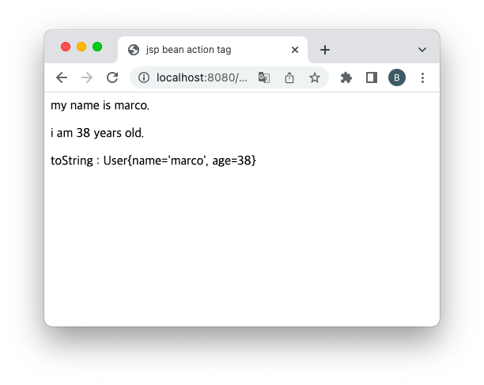

= JavaBeans 실습

== User.java

[source,java]
----
public class User implements Serializable {
    public User(){

    }
    private String name;
    private Integer age;

    public String getName() {
        return name;
    }

    public void setName(String name) {
        this.name = name;
    }

    public Integer getAge() {
        return age;
    }

    public void setAge(Integer age) {
        this.age = age;
    }

    @Override
    public String toString() {
        return "User{" +
                "name='" + name + '\'' +
                ", age=" + age +
                '}';
    }
}

----

== bean.jsp

[source,html]
----
<%@ page contentType="text/html;charset=UTF-8" language="java" %>
<html>
<head>
    <title>jsp bean action tag</title>
</head>
<body>
    <jsp:useBean id="user1" scope="request" class="com.nhnacademy.jsp.beans.User" />    <jsp:setProperty name="user1" property="name" value="marco" />
    <jsp:setProperty name="user1" property="age" value="38" />

    
my name is <jsp:getProperty name="user1" property="name"/>.

    
i am <jsp:getProperty name="user1" property="age"/> years old.

    
toString : <%=request.getAttribute("user1")%>

</body>
</html>

----

== 실행결과

=== scope를 session으로 변경

[source,xml]
----
<jsp:useBean id="user1" scope="session" class="com.nhnacademy.jsp.beans.User" />
//...

toString : <%=request.getAttribute("user1")%>

----

=== scope를 application으로 변경

[source,xml]
----
<jsp:useBean id="user1" scope="application" class="com.nhnacademy.jsp.beans.User" />
// ...

toString : <%=application.getAttribute("user1")%>

----

=== value 대신 param 속성 사용하기

* bean.jsp?userName=marco&amp;userAge=38

[source,xml]
----
<jsp:setProperty name="user1" property="name" param="userName" />
<jsp:setProperty name="user1" property="age" param="userAge" />
----