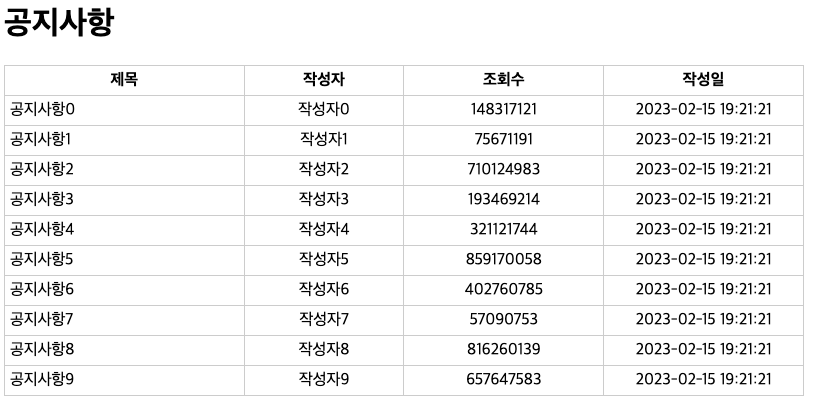

= 공지사항 list 출력

* 제목 : 공지사항0 ~ 공지사항9
* 작성자 : 작성자0 ~ 작성자9
* 조회수 : Long random
* 작성일 : Date : pattern : yyyy-MM-dd HH:mm:ss

== dependency

[source,xml]
----
<dependency>
    <groupId>org.apache.commons</groupId>
    <artifactId>commons-math3</artifactId>
    <version>3.6.1</version>
</dependency>

----

== Notice.java

[source,java]
----
import java.io.Serializable;
import java.util.Date;

public class Notice implements Serializable {
    public Notice(){

    }

    public Notice(String subject, String name, long counter) {
        this.subject = subject;
        this.name = name;
        this.counter = counter;
        this.createdAt = new Date();
    }

    private String subject;
    private String name;
    private Long counter;
    private Date createdAt;

    public String getSubject() {
        return subject;
    }

    public void setSubject(String subject) {
        this.subject = subject;
    }

    public String getName() {
        return name;
    }

    public void setName(String name) {
        this.name = name;
    }

    public Long getCounter() {
        return counter;
    }

    public void setCounter(Long counter) {
        this.counter = counter;
    }

    public Date getCreatedAt() {
        return createdAt;
    }

    public void setCreatedAt(Date createdAt) {
        this.createdAt = createdAt;
    }
}

----

== NoticeServlet.java

[source,java]
----
import org.apache.commons.math3.random.RandomDataGenerator;
import javax.servlet.RequestDispatcher;
import javax.servlet.ServletException;
import javax.servlet.annotation.WebServlet;
import javax.servlet.http.HttpServlet;
import javax.servlet.http.HttpServletRequest;
import javax.servlet.http.HttpServletResponse;
import java.io.IOException;
import java.util.ArrayList;
import java.util.List;

@WebServlet(name = "NoticeServlet", urlPatterns = "/jstl/notice")
public class NoticeServlet extends HttpServlet {
    @Override
    protected void doGet(HttpServletRequest req, HttpServletResponse resp) throws ServletException, IOException {
        List<Notice> noticeList = new ArrayList<>();
        for(int i=0; i<10; i++){
            String subject = "공지사항" + i;
            String name="작성자" + i;
            long counter = new RandomDataGenerator().nextLong(1,1000000000);
            noticeList.add(new Notice(subject,name,counter));
        }
        req.setAttribute("noticeList",noticeList);

        RequestDispatcher rd = req.getRequestDispatcher("/jstl/notice.jsp");
        rd.forward(req,resp);
    }
}

----

== notice.jsp

[source,xml]
----
<%@ page contentType="text/html;charset=UTF-8" language="java" trimDirectiveWhitespaces="true" %>
<%@ taglib prefix="c"  uri="http://java.sun.com/jsp/jstl/core" %>
<%@ taglib prefix="fmt" uri="http://java.sun.com/jsp/jstl/fmt" %>
<html>
<head>
    <title>공지사항</title>
    
</head>
<body>
    <h1>공지사항</h1>
    <table>
        <thead>
            <tr>
                <th style="width: 30%" >제목</th>
                <th style="width: 20%" >작성자</th>
                <th style="width: 25%">조회수</th>
                <th style="width: 25%">작성일</th>
            </tr>
        </thead>
        <tbody>
        <c:forEach var="item" items="${noticeList}">
            <tr>
                <td>${item.subject}</td>
                <td style="text-align: center">${item.name}</td>
                <td style="text-align: center">${item.counter}</td>
                <td style="text-align: center">
                    <fmt:formatDate value="${item.createdAt}" pattern="yyyy-MM-dd HH:mm:ss" />
                </td>
            </tr>
        </c:forEach>
        </tbody>
    </table>
</body>
</html>
----