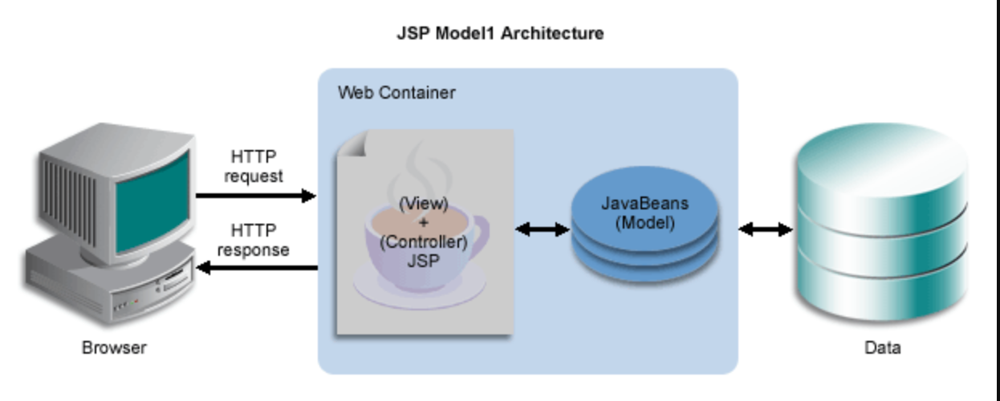
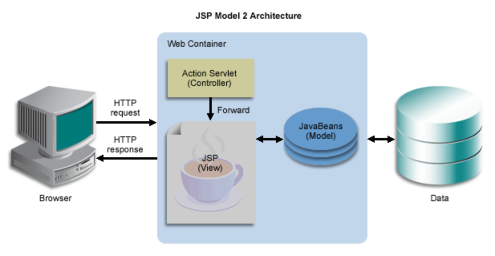
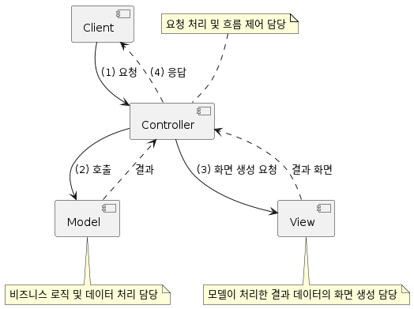
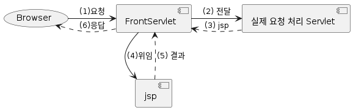

= MVC

=== Model 1

* JSP에서 모든 로직과 출력을 처리합니다.
* 즉 JSP 페이지에 비지니스 로직을 처리하기 위한 코드와 웹브라우저에 결과를 출력하는 코드가 섞여 있습니다.

=== Model 2

* 모든 요청을 서블릿이 받아 처리하고 JSP 페이지로 포워드 합니다.
** 서블릿은 클라이언트(브라우저) 요청을 구분하여 처리합니다.

=== Model 2 방식 = MVC Pattern

* Model: 비즈니스 로직 및 데이터 처리 담당
* View: 모델이 처리한 결과 데이터의 화면 생성 담당
* Controller: 요청 처리 및 흐름 제어 담당

=== 이렇게 하면 뭐가 좋죠?

=== MVC Pattern의 장점

* 유연하고 확장이 용이
* 협업이 용이
* 유지보수 용이

=== 그런데 Servlet들을 보다 보니…

==== *뭔가 중복이*

[source,java]
----
resp.setContentType("text/html");
resp.setCharacterEncoding("UTF-8");

// ...

try {
    RequestDispatcher rd = req.getRequestDispatcher("...");
    rd.forward(req, resp);
    // resp.sendRedirect("...");
} catch (ServletException | IOException ex) {
    log.error("", ex);
}

----

== 공통 처리 부분과 그렇지 않은 부분을 나눠보면 어떨까?

=== *공통 처리 부분*

==== *ForntServlet*

. 모든 요청을 FrontServlet이 다 받아서
** 모든 요청을 다 받으면? 실제 요청이랑은 어떻게 구분?
*** FrontServlet이 받을 요청은 .do 확장자를 사용
*** 실제 요청은 .do 확장자가 없음
*** Ex.)
**** /foods.do : FrontServlet 이 처리
**** /foods : 실제 요청은 Servlet에서 처리
. 요청 URL에 따라 실제 요청을 처리할 Servlet으로 요청을 전달
. 실제 요청을 처리한 Servlet은 처리 결과를 어떤 jsp에서 view 할 건지를 반환
. 실제 요청을 처리한 Servlet이 전달해 준 jsp로 view 처리를 위임
** 에러가 발생한 경우는 error page로 지정된 jsp에게 view 처리를 위임
. JSP는 실제 요청을 처리한 Servlet에서 ServletRequest에 설정한 속성을 이용해 view 처리를 수행
. FrontServlet이 요청에 대해 응답

=== FrontServlet

[source,java]
----
@Slf4j
@WebServlet(name = "frontServlet", urlPatterns = "*.do")
public class FrontServlet extends HttpServlet {
    private static final String REDIRECT_PREFIX = "redirect:";

    @Override
    protected void service(HttpServletRequest req, HttpServletResponse resp)
        throws ServletException, IOException {
        // 공통 처리 - 응답 content-type, character encoding 지정.
        resp.setContentType("text/html");
        resp.setCharacterEncoding("UTF-8");

        try {
            // 실제 요청 처리할 Servlet 결정.
            String processingServletPath = resolveServlet(req.getServletPath());

            // 실제 요청을 처리할 Servlet으로 요청을 전달하여 처리 결과를 include시킴.
            RequestDispatcher rd = req.getRequestDispatcher(processingServletPath);
            rd.include(req, resp);

            // 실제 요청을 처리한 Servlet이 `view`라는 request 속성 값으로 view를 전달해 줌.
            String view = (String) req.getAttribute("view");
            if (view.startsWith(REDIRECT_PREFIX)) {
                // `redirect:`로 시작하면 redirect 처리.
                resp.sendRedirect(view.substring(REDIRECT_PREFIX.length()));
            } else {
                // redirect 아니면 JSP에게 view 처리를 위임하여 그 결과를 include시킴.
                rd = req.getRequestDispatcher(view);
                rd.include(req, resp);
            }
        } catch (Exception ex) {
            // 에러가 발생한 경우는 error page로 지정된 `/error.jsp`에게 view 처리를 위임.
            log.error("", ex);
            req.setAttribute("exception", ex);
            RequestDispatcher rd = req.getRequestDispatcher("/error.jsp");
            rd.forward(req, resp);
        }
    }

    // ...
}
----

=== FrontServlet (계속)

[source,java]
----
public class FrontServlet extends HttpServlet {
    // ...

    // 요청 URL에 따라 실제 요청을 처리할 Servlet 결정.
    private String resolveServlet(String servletPath) {
        String processingServletPath = null;

        if ("/cart.do".equals(servletPath)) {
            processingServletPath = "/cart";
        } else if ("/foods.do".equals(servletPath)) {
            processingServletPath = "/foods";
        } else if ("/login.do".equals(servletPath)) {
            processingServletPath = "/login";
        } else if ("/logout.do".equals(servletPath)) {
            processingServletPath = "/logout";
        } else if ("/change-lang.do".equals(servletPath)) {
            processingServletPath = "/change-lang";
        }

        return processingServletPath;
    }
}
----

=== FrontServlet 적용

=== Servlet에서는

* 공통 로직 제거 - FrontServlet 해주니까
* view 처리 - request.setAttribute("view", "{JSP 경로}") 만 해주면 됨

=== Servlet과 JSP 에서 외부 접근 URL은 모두 /???.do로 변경

* 사용자에게 노출되는 URL은 .do 확장자를 가짐
* 실제 요청 처리 URL은 .do 확장자가 없음

=== Filter 적용 URL도 모두 *.do로 변경

* RequestDispatcher 에 의한 include/forward 시 request 공유되기 때문에 Filter 처리도 .do URL만 하면 됨

=== 이렇게 해놓고 보니…

* HttpServletRequest, HttpServletResponse 를 인자로 받아서
* request.setAttribute("view", "{JSP 경로}")에 지정할 view JSP 경로만 전달해줌

=== doGet(), doPost() 각각을 나눠서 별도의 클래스로 분리한다고 하면

* 각각의 클래스들은
** FrontServlet과는 RequestDispatcher 에 의해 request가 공유되
** view JSP 경로만 제공해주면 FrontServlet에서 response에 대한 공통 처리가 이루어지므로
*** 굳이 Servlet일 필요도 없음
** 하나의 공통된 메서드를 가지는 인터페이스
*** HttpServletRequest, HttpServletResponse 를 인자로 받고
*** view JSP 경로를 반환
** 를 구현하는 여러 클래스들로 구현 가능
*** 각각의 클래스에서 실제 요청을 처리