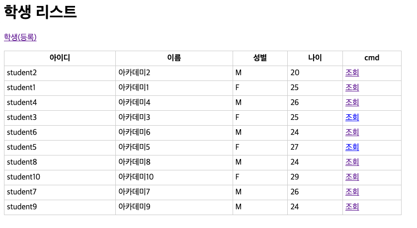

= 학생-리스트

* 해당 이미지를 고려하여 개발합니다.

== StudentRegisterServlet.java

[source,java]
----
@Slf4j
@WebServlet(name = "studentListServlet", urlPatterns = "/student/list")
public class StudentListServlet extends HttpServlet {

    private StudentRepository studentRepository;

    @Override
    public void init(ServletConfig config) throws ServletException {
       studentRepository = (StudentRepository) config.getServletContext().getAttribute("studentRepository");
    }

    @Override
    protected void doGet(HttpServletRequest req, HttpServletResponse resp) throws ServletException, IOException {
       //student list 구하기

        req.setAttribute("studentList",studentList);

       // /student/list.jsp <- forward 하기
    }

}

----

== /student/list.jsp

[source,html]
----
<%@ page contentType="text/html;charset=UTF-8" language="java" trimDirectiveWhitespaces="true" %>
<%@ taglib prefix="c" uri="http://java.sun.com/jsp/jstl/core" %>

<html>
<head>
    <title>student - list</title>
    <link rel="stylesheet" href="/style.css" />
</head>

<body>
    <h1>학생 리스트</h1>
    
<a href="/student/register" >학생(등록)</a>

    <table>
        <thead>
            <tr>
                <th>아이디</th>
                <th>이름</th>
                <th>성별</th>
                <th>나이</th>
                <th>cmd</th>
            </tr>
        </thead>
        <tbody>
        <!--todo list 구현하기 c:foreach -->
        </tbody>
    </table>
</body>
</html>
----