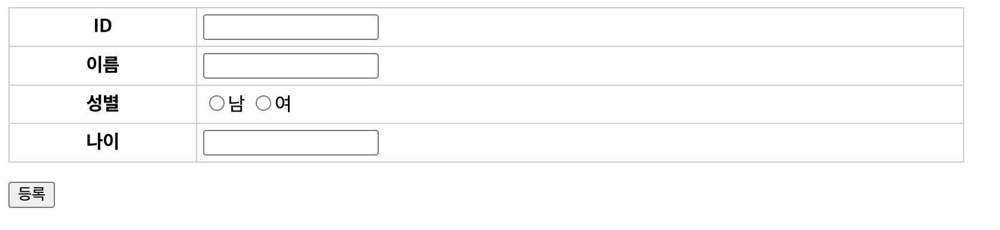

= 학생-등록

== StudentRegisterServlet.java

[source,java]
----
@WebServlet(name = "studentRegisterServlet", urlPatterns = "/student/register")
public class StudentRegisterServlet extends HttpServlet {

    private StudentRepository studentRepository;

    @Override
    public void init(ServletConfig config) throws ServletException {
        //todo  init studentRepository 
    }

    @Override
    protected void doGet(HttpServletRequest req, HttpServletResponse resp) throws ServletException, IOException {
        //todo  /student/register.jsp forward 합니다.
    }

    @Override
    protected void doPost(HttpServletRequest req, HttpServletResponse resp) throws ServletException, IOException {
            
        //todo null check
        
        //todo save 구현
        studentRepository.save(student);
        
        //todo redirect /student/view?id=student1
    }
    
}
----