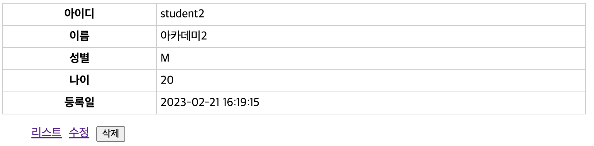

= 학생 - 조회

* 등록일 : customTag 참고
** https://nhnacademy.dooray.com/share/pages/wNriZC3NRea9fwieaPlqfw/3474173583292731916

== StudentViewServlet.java

[source,java]
----
@Slf4j
@WebServlet(name = "studentViewServlet", urlPatterns = "/student/view")
public class StudentViewServlet extends HttpServlet {
    private StudentRepository studentRepository;

    @Override
    public void init(ServletConfig config) throws ServletException {
      
    }

    @Override
    protected void doGet(HttpServletRequest req, HttpServletResponse resp) throws ServletException, IOException {
        //todo id null check

        //todo student 조회
        req.setAttribute("student",student);
        
        //todo /student/view.jsp <-- forward
    }
    
}

----

== /student/view.jsp

[source,html]
----
<%@ page contentType="text/html;charset=UTF-8" language="java" trimDirectiveWhitespaces="true" %>
<%@ taglib prefix="c"  uri="http://java.sun.com/jsp/jstl/core" %>
<%@ taglib prefix="cfmt" uri="http://nhnacademy.com/cfmt" %>
<html>
<head>
    <title>학생-조회</title>
    <link rel="stylesheet" href="/style.css" />
</head>
<body>
    <table>
        <tbody>
            <!-- todo view 구현 -->

        </tbody>
    </table>
    <ul>
        <li><a href="/student/list">리스트</a></li>
        <li>
            <!-- todo ${update_link} 설정 c:url -->
            <a href="${update_link}">수정</a>
        </li>
        <li>
           <!-- todo 삭제버튼 구현, method=post
        </li>
        
    </ul>

</body>
</html>
----