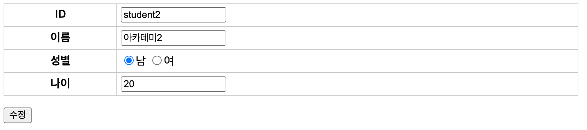

= 학생 - 수정

* /student/register.jsp를 이용해서 구현합니다.

== StudentUpdateServlet

[source,java]
----
@WebServlet(name = "studentUpdateServlet", urlPatterns = "/student/update")
public class StudentUpdateServlet extends HttpServlet {
    private StudentRepository studentRepository;
    @Override
    public void init(ServletConfig config) throws ServletException {
        //todo init studentRepository
    }

    @Override
    protected void doGet(HttpServletRequest req, HttpServletResponse resp) throws ServletException, IOException {

        //todo 학생조회

        req.setAttribute("student",student);

       //todo forward : /student/register.jsp

    }

    @Override
    protected void doPost(HttpServletRequest req, HttpServletResponse resp) throws ServletException, IOException {

        //todo null check

        //todo student 저장

        studentRepository.update(student);

        //todo /student/view?id=student1 <-- redirect
    }
}

----

== /student/register.jsp

[source,html]
----
<%@ page contentType="text/html;charset=UTF-8" language="java" %>
<%@ taglib prefix="c" uri="http://java.sun.com/jsp/jstl/core" %>

<html>
    <head>
        <title>학생-등록</title>
        <link rel="stylesheet" href="/style.css" />
        <meta charset="UTF-8" />
    </head>

    <body>
        <!-- todo action 주소 설정
            //등록
                action = /student/register
            //수정
                action = /student/update
        -->

        <form method="post" action="${action}">
            <table>
                <tbody>
                    <tr>
                        <th>ID</th>
                        <td><input type="text" name="id" value="${student.id}" required /></td>
                    </tr>
                    <!-- todo input 구현 -->
                    
                    </tr>
                </tbody>
            </table>
            

                <button type="submit">
                    <c:choose>
                        <c:when test="${empty student}">
                            등록
                        </c:when>
                        <c:otherwise>
                           수정
                        </c:otherwise>
                    </c:choose>
                </button>
            

        </form>
    </body>
</html>
----