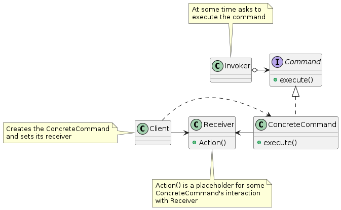
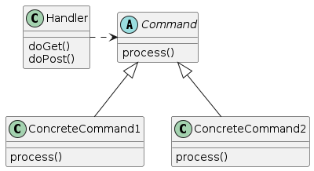
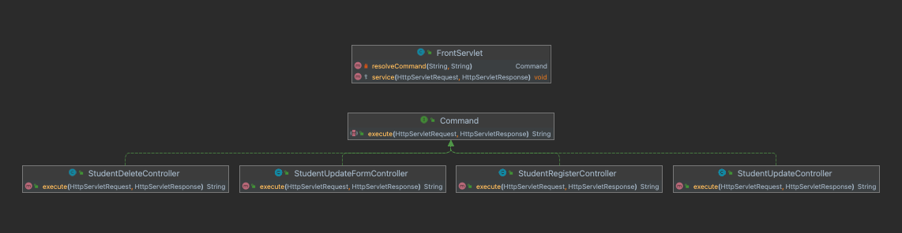
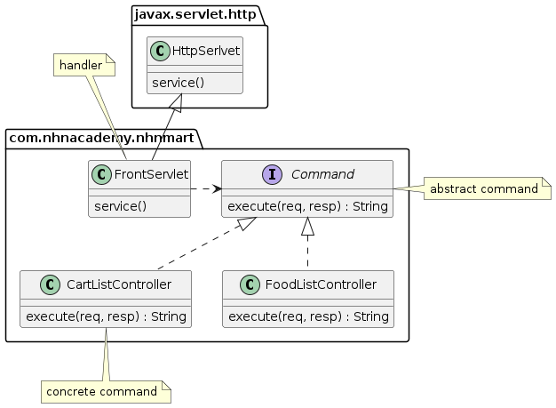

= `Command` 패턴으로 추상화 가능?

== Command 패턴

* 요청을 객체의 형태로 캡슐화하여
* command를 저장하거나 메서드에 전달하거나 다른 객체들처럼 반환할 수 있게 해주는 디자인 패턴

----
Command 패턴은 객체 지향 디자인 패턴 중 하나로, 요청을 객체로 캡슐화하여 요청을 수신하는 객체가 이를 처리할 수 있도록 하는 패턴입니다.
Command 패턴은 다음과 같은 구성 요소로 이루어집니다.
 - Command: 요청을 캡슐화하는 인터페이스를 정의합니다. Command 인터페이스는 execute() 메서드를 선언합니다.
 - ConcreteCommand: Command 인터페이스를 구현한 구체적인 클래스입니다. execute() 메서드를 구현하여 실제 요청 처리를 수행합니다.
 - Invoker: 요청을 수신하는 객체를 정의합니다. Invoker는 Command 객체를 유지하고, execute() 메서드를 호출하여 요청을 처리합니다.
 - Receiver: 실제 요청 처리를 수행하는 객체입니다. ConcreteCommand는 Receiver 객체를 호출하여 실제 요청 처리를 수행합니다.

Command 패턴을 사용하면 다음과 같은 이점이 있습니다.
 - 요청 처리 과정을 캡슐화하므로, 요청 처리 과정의 변경이나 확장에 유연하게 대응할 수 있습니다.
 - 요청 처리에 대한 로깅, 취소, 다시 실행 등의 기능을 구현하기 쉽습니다.
 - 객체 간의 의존성을 줄일 수 있으며, 객체 간의 결합도를 낮출 수 있습니다.

Command 패턴은 GUI 애플리케이션에서는 메뉴나 버튼 등의 요소들과 이벤트 핸들러 등에서 사용됩니다. 
또한, 웹 애플리케이션에서도 HTTP 요청과 응답 처리에 Command 패턴을 적용할 수 있습니다.

----

== 실제 요청을 처리하는 Servlet에 Command 패턴 적용

=== Command interface

[source,java]
----
public interface Command {
    String execute(HttpServletRequest request, HttpServletResponse response);
}
----

== 실제 요청을 처리하는 Servlet들

* 기존 Servlet과 구별하기 위해 `-Servlet` 대신 `-Controller`라는 접미사를 사용
* Command interface를  구현합니다.

=== StudentDeleteServlet ( before )

[source,java]
----
@Slf4j
@WebServlet(name = "studentDeleteServlet", urlPatterns = "/student/delete")
public class StudentDeleteServlet extends HttpServlet {

    private StudentRepository studentRepository;

    @Override
    public void init(ServletConfig config) throws ServletException {
        studentRepository = (StudentRepository) config.getServletContext().getAttribute("studentRepository");
    }

    @Override
    protected void doPost(HttpServletRequest req, HttpServletResponse resp) throws ServletException, IOException {
       // ....
    }
}
----

=== StudentDeleteController

[source,java]
----
public class StudentDeleteController implements Command {
    @Override
    public String execute(HttpServletRequest req, HttpServletResponse resp) {
        StudentRepository studentRepository = (StudentRepository) req.getServletContext().getAttribute("studentRepository");
        String id = req.getParameter("id");
        studentRepository.deleteById(id);
        //view를 return 합니다.
        return "redirect:/student/list.do";
    }
}
----

== 실제 요청을 처리하는 Servlet들 (계속)

=== StudentListServlet

=== StudentRegisterServlet

* GET
** StudentRegisterFormController
* POST
** StudentRegisterController

=== StudentUpdateServlet

* GET
** StudentUpdateFormController
* POST
** StudentUpdateController

=== StudentViewServlet

* GET
** StudentViewController

== `Command` 패턴을 적용하면 `FrontServlet`은?

=== before: `resolveServlet`

[source,java]
----
private String resolveServlet(String servletPath){
    String processingServlet = null;
    if("/student/list.do".equals(servletPath)){
        processingServlet = "/student/list";
    }else if("/student/view.do".equals(servletPath)){
        processingServlet = "/student/view";
    }else if("/student/delete.do".equals(servletPath)){
        processingServlet = "/student/delete";
    }else if("/student/update.do".equals(servletPath)){
        processingServlet = "/student/update";
    }else if("/student/register.do".equals(servletPath)){
        processingServlet = "/student/register";
    }else if("/error.do".equals(servletPath)){
        processingServlet = "/error";
    }
    return processingServlet;
}
----

=== after: `resolveCommand`

[source,java]
----
private Command resolveCommand(String servletPath, String method){
       Command command = null;
        if("/student/list.do".equals(servletPath) && "GET".equalsIgnoreCase(method) ){
          command = new StudentListController();
        }else if("/student/view.do".equals(servletPath) && "GET".equalsIgnoreCase(method) ){
            command = new StudentViewController();
        }else if("/student/delete.do".equals(servletPath) && "POST".equalsIgnoreCase(method) ){
            command = new StudentDeleteController();
        }else if("/student/update.do".equals(servletPath) && "GET".equalsIgnoreCase(method) ){
            command = new StudentUpdateFormController();
        }else if("/student/update.do".equals(servletPath) && "POST".equalsIgnoreCase(method) ){
            command = new StudentUpdateController();
        }else if("/student/register.do".equals(servletPath) && "GET".equalsIgnoreCase(method) ){
            command = new StudentRegisterFormController();
        }else if("/student/register.do".equals(servletPath) && "POST".equalsIgnoreCase(method) ){
            command = new StudentRegisterController();
        }else if("/error.do".equals(servletPath)){
            command = new ErrorController();
        }
        return command;
    }
----

== Model 2 방식 = MVC Pattern 에서 Servlet 구현 개선

=== 지금까지 작업한 내용 정리

* `FontServlet` 으로 공통 처리 부분 모으고
** response content-type, character encoding 지정
** view 처리
** 예외 처리
** 기타 공통로직 처리
* 실제 요청 처리 Servlet은
** 호출 규칙을 추상화하기 위해 Command 패턴 적용
** 실제 요청을 처리하던 Servlet은 Command interface를 구현하는 Servlet이 아닌 일반 클래스
*** HttpServlet에 대한 의존성 X
*** 재사용성 높아짐

____
 즉, 모든 요청은 FrontServlet이 받아서 처리하고 Servlet에 대한 의존성을 낮춰 재사용성이 높아짐. 이런 것을 Front Controller pattern이라고 부르고 있음.
____

== FrontController Pattern

=== FrontController

* 웹 사이트의 모든 요청을 처리하는 컨트롤러 (A controller that handles all requests for a web site)
* 보안, 국제화, 뷰 제공 등의 공통적인 작업을 수행
* cf.) Front Controller vs Page Controller

https://www.martinfowler.com/eaaCatalog/frontController.html

=== 단점도 존재함..

* Command 구현체가 n개 …
* resolve의 if에 의한 분기처리

=== Nhnmart에 적용 예
