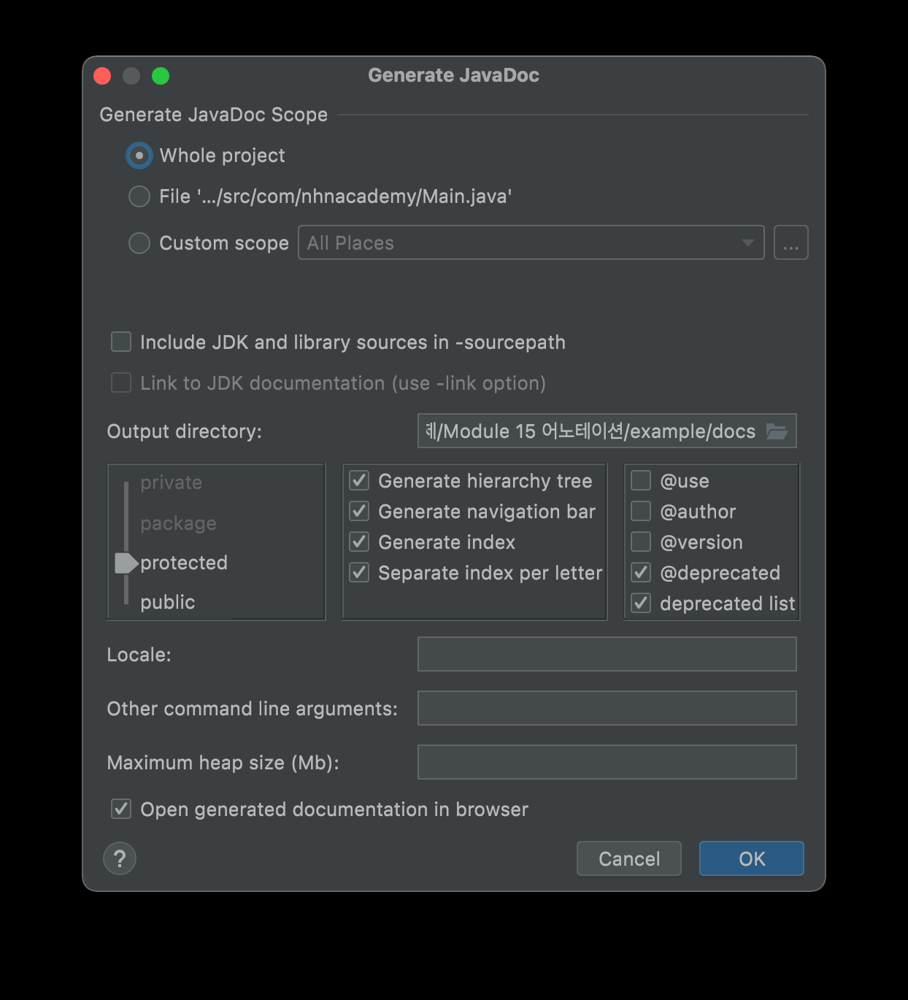
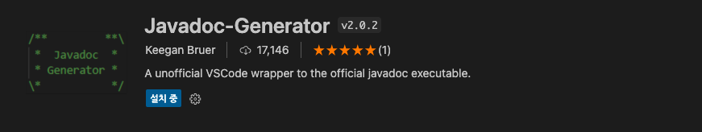
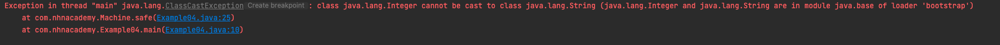
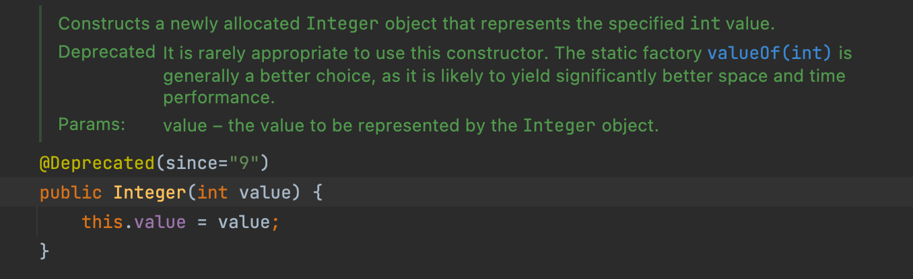

= Annotation

== Java Doc

* java에서는 소스코드에 대한 문서를 따로 만들기 보다는 소스코드와 문서를 하나의 파일로 관리하기 위해서 주석에 " /** **/ " 소스코드에 대한 정보를 저장하고 HTML문서로 만들어서 문서화를 했습니다.

|===
|tag |설명
|*@author* |*클래스나 인터페이스의 제작자 표시*
|*@version*|*클래스나 인터페이스에서의 버전 정보*
|*@param* |*매개 변수에 대한 설명*
|*@return* |*메소드가 void를 리턴하거나 생성자가 아닌 경우를 제외하고 모두 사용해야 함*
|@exception, @throws |메소드가 발생시킬 수 있는 예외를 기술
|@deprecated |다음 버전에서 폐기된 메소드를 알림
|@serial |기본적으로 직렬화 할 수 있는 클래스의 멤버를 설명
|*@see* |*- 어떤 클래스, 인터페이스, 메소드, 생성자 혹은 URL에 대한 전후참조 표시 - 분리된 줄에 링크가 생김*
|@since |Tag를 가진 객체가 언제 추가되었는지 명시  
|{@link #entity label} |메소드나 필드의 상호 참조에 대한 링크를 표시문서 텍스트 안에 링크가 생김 
|{@doc-root} | 문서에 대한 루트디렉토리에 대한 상대경로 지정 
|===

=== Java Doc 생성 ( Intellij )

* Shift + Shift. ( 더블 Shift )
** Generate JavaDoc

=== JavaDoc 생성(VSCODE)

* 확장 : Javadoc-Generator 설치 : 설치하는데 시간이 소요될 수 있음.
* https://marketplace.visualstudio.com/items?itemName=KeeganBruer.javadoc-generator

* 사용방법
** windows: The main command for this extension is accessed using CTRL + SHIFT + P  then selecting "Javadoc Generator: Generate Javadoc".
** mac : command + SHIFT + P

=== JavaDoc 예제

[source,java]
----
/**
 * JavaDoc Example class
 *
 * @author  marco
 * @version 1.1
 * @see Example01#printMessage(String)
 *
 */
public class Example01 {

    /**
     * message parameter에 대한 설명.
     */
    private String message = "hello java";

    /**
     * message parameter를 받아서 console에 출력하는 method
     *
     * @param message  consone 출력할 message
     * @see Example01
     * @return message가 정상출력 되면 true 실패하면 false 반환
     */
    public boolean printMessage(String message) {
        boolean result = true;
        try {
            System.out.println(message);
        }catch (Exception e) {
            result = false;
        }
        return result;
    }

}

----

== Annotation 이란?

* 프로그램을 구성하는 직접적인 코드는 아니지만 프로그램 작성에 도움을 주거나 필요한 데이터를 제공합니다.
* Java5 부터지원
* 그럼 JavaDoc도 Annotation?
** 단순 주석을 문서화 하는 도구일 까요?
** 주석은 주석이고 Annotation은 Annotation ,.

== Annotation의 용도

* 컴파일러에게 코드 작성 문법 에러를 체크 하도록 정보를 제공
* 소프트웨어 개발툴이 빌드나 배치시 코드를 자동으로 생성할 수 있도록 정보 제공
** Lombok
* 런타임시 특정 기능을 실행 하도록 정보 제공
* *AOP 관점지향 프로그래밍*

== Annotation 형식

=== @ 뒤에 어노테이션 이름을 붙이는 형식으로 구성되어 있습니다.

* 대표적으로 @Override Annotation이 있습니다.
** Annotation에 설정할 별도의 요소가  없는 경우 Marker annotation이라고 합니다.

[source,java]
----
public class MallardDuck implements Duck {
    @Override
    public void quack() {
        System.out.println("Quack");
    }

    @Override
    public void fly() {
        System.out.println("I'm flying");
    }
}
----

== Java 내장 Annotation

=== @Override

* 재정의된 메소드
* 상위(부모)에서 해당 메서드를 찾을 수 없다면 컴파일 에러 발생

=== @SuppressWarnings

* 알고 있는 내용으로 경고 필요 없음 즉 컴파일 경고를 무시하도록 합니다.
* all : 모든 경고
* cast : 캐스트 연산자 관련 경고
* dep-ann : 사용하지 말아야 할 주석 관련 경고
* deprecation : 사용하지 말아야 할 메서드 관련 경고
* fallthrough : switch문에서 break 누락 관련 경고
* finally : 반환하지 않는 finally 블럭 관련 경고
* null : null 분석 관련 경고
* rawtypes : 제너릭을 사용하는 클래스 매개 변수가 불특정일 때의 경고
* unchecked : 검증되지 않은 연산자 관련 경고
* unused : 사용하지 않는 코드 관련 경고

[source,java]
----
public class Example03 {

    public static void main(String[] args) {

        @SuppressWarnings({"unused"})
        String name="marco";

        System.out.println("hello marco");

        @SuppressWarnings({"unused","deprecation"})
        Integer a = new Integer(1);

        @SuppressWarnings({"rawtypes"})
        List list = new LinkedList<>();
        Box<String> box = new Box<>("marco");
        list.add(box);
    }

    public static class Box<T> {
        private final T t;

        public Box(T t) {
            this.t = t;
        }

        public T getT() {
            return t;
        }
    }
}
----

=== @SafeVarargs

* Java7 부터 지원.
* 지네릭스 타입의 가변인자에 사용합니다.
* 컴파일러가 확인하기 어려운 까다로운 문제
* heap pollution 문제..
** 공변성 배열 예제를 생각해보기

[source,java]
----
public class Example04 {

    public  static  void main(String[] args) {
        Machine machine = new Machine<>();
        machine.safe(Integer.valueOf(1),String.valueOf("1.1"));

    }
}

class Machine<T> {
    private final List<T> versions = new ArrayList<>();

    @SafeVarargs
    public final void safe(T... toAdd) {
        for (T version : toAdd) {
            versions.add(version);
        }

        for( T t : versions){
            print((String) t);
        }
    }
    void print(String t){
        System.out.println(t);
    }
}
----

=== @FunctionalInterface

* java에서 함수형 프로그램을 하기 위해서 인터페이스를 일급함수를 만들기 위해서 사용합니다.
* lamda 쪽에서 자세히 설명..

=== @Native

* native 메소드에서 참조되는 상수 앞에 붙인다.

== Meta Annotation

* *Java5에 추가된  기능으로 어노테이션을  선언할 때 사용하는  어노테이션 입니다.*

=== @Target

* Annotation이 적용가능한 대상을 지정하는데 사용합니다.
* 즉 컴파일러가 Annotation을 어디에 적용할지 결정하는 Annotation 입니다.
* Annotation 적용 위치
** ElementType.PACKAGE : 패키지 선언
** ElementType.TYPE : 타입 선언
** ElementType.ANNOTATION_TYPE : 어노테이션 타입 선언
** ElementType.CONSTRUCTOR : 생성자 선언
** ElementType.FIELD : 멤버 변수 선언
** ElementType.LOCAL_VARIABLE : 지역 변수 선언
** ElementType.METHOD : 메서드 선언
** ElementType.PARAMETER : 전달인자 선언
** ElementType.TYPE_PARAMETER : 전달인자 타입 선언
** ElementType.TYPE_USE : 타입 선언

=== @Retention

* Annotation이 유지되는 범위를 지정하는데 사용합니다.
* 범위
** RetentionPolicy.RUNTIME
*** 컴파일 이후에도 JVM 에 의해서 계속 참조가 가능합니다. 
*** 주로 리플렉션이나 로깅에 많이 사용됩니다.
** RetentionPolicy.CLASS
*** 컴파일러가 클래스를 참조할 때가지 유효합니다.
** RetentionPolicy.SOURCE
*** 컴파일 전까지만 유효합니다.
*** 즉, 컴파일 이후에는 사라지게 됩니다.

=== @Inherited

* Annotation이 자손 클래스에 상속되도록 합니다.

=== @Deprecated

* 언제 지원이 중단될지 모르니 사용하지 말 것을 권장함

[source,java]
----
public class Example02 {
    public static void main(String[] args) {
        Integer a = new Integer(1);

    }
}
----

* 위 예제 에서는  아래처럼 변경해야함.

----
Integer b = Integer.valueOf(1);
----

=== @Repeatable

* Annotation을 반복해서 적용할 수 있게 합니다.

=== @Documented

* Annotation정보가 Javadoc으로 작성된 문서에 포함되게 합니다.