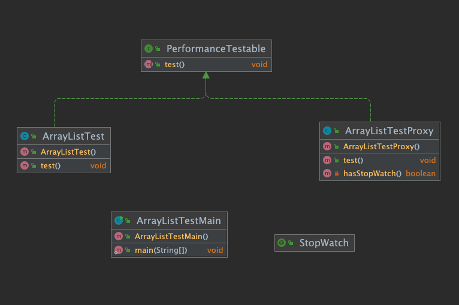
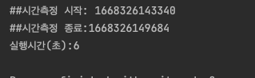

= Annotation을 이용한 StopWatch 만들기

* ArrayList의  1 to 100000000 까지  add 하는 예제입니다.
* Collection Framework List 편에서 LinkedList, ArrayList의 성능 이슈에 대한 시간(초) 측정 테스트를 Annotation을 이용해서 구현하는 간단한 예제 입니다.

== 선수학습

* Proxy Pattern 선수 학습하기
* Reflection
* annotation

== Proxy pattern을 이용한 단순한 구조

== StopWatch.java

* 실행시간 측정을 자동화할 StopWatch Annotation을 정의 합니다.

[source,java]
----
import java.lang.annotation.ElementType;
import java.lang.annotation.Retention;
import java.lang.annotation.RetentionPolicy;
import java.lang.annotation.Target;

@Target(value = {ElementType.METHOD})
@Retention(RetentionPolicy.RUNTIME)

public @interface StopWatch {

}

----

== PerformanceTestable.java

* test 인터페이스 정의

[source,java]
----
public interface PerformanceTestable {
    void test();
}

----

== ArrayListTest.java

[source,java]
----
public class ArrayListTest implements PerformanceTestable {

    @StopWatch
    @Override
    public void test() {
        List<Integer> integerList = new ArrayList<>();
        for(int i=0; i<100000000; i++){
            integerList.add(i);
        }
    }
}
----

== ArrayListTestMain.java

* main 만들어서 실행하기
* 동작은 하지만 실행시간에 대한 측정은 일어나지 않습니다.
* 여기까지는 일반적인 객체 생성 후 method 실행하는 과정

[source,java]
----
public class ArrayListTestMain {
    public static void main(String[] args) {
        ArrayListTest arrayListTest = new ArrayListTest();
        arrayListTest.test();
    }
}
----

== ArrayListTestProxy.java

* PerformanceTestable 구현한 ArrayListTestProxy를 생성합니다.
* 즉 ArrayListTest 는 ArrayListTestProxy로 한 번 감싸서 실행을 합니다.
* 사용자 입장에서는 내부적으로 어떻게 호출 되는지 알 수 없습니다.

[source,java]
----
public class ArrayListTestProxy implements PerformanceTestable {
    private final PerformanceTestable performanceTestable;

    public ArrayListTestProxy(PerformanceTestable performanceTestable) {
        this.performanceTestable = performanceTestable;
    }

    @Override
    public void test() {
        if(hasStopWatch()) {
            long start = System.currentTimeMillis();
            System.out.println("##시간측정 시작: " + start );
            performanceTestable.test();
            long end = System.currentTimeMillis();
            System.out.println("##시간측정 종료:" + end);
            long result = (end - start)/1000;
            System.out.println("실행시간(초):" + result);
        }
    }

    private boolean hasStopWatch(){
        for(Method method : performanceTestable.getClass().getDeclaredMethods()){
            StopWatch stopWatch = method.getAnnotation(StopWatch.class);
            if(Objects.nonNull(stopWatch)){
                return true;
            }
        }
        return false;
    }
}
----

== ArrayListTestMain.java

* main 실행을 ArrayListTestProxy를 통해서 실행 합니다.

[source,java]
----
public class ArrayListTestMain {
    public static void main(String[] args) {
        ArrayListTestProxy arrayListTestProxy = new ArrayListTestProxy();
        arrayListTestProxy.test();
    }
}
----

== 실행결과

* 실행시간(초) 단위로 측정 됩니다.

== 연습문제

* LinkedListTest.java를 만들어서 ArrayListTest와 실행시간(초) 비교할 수 있도록 구현해 주세요.